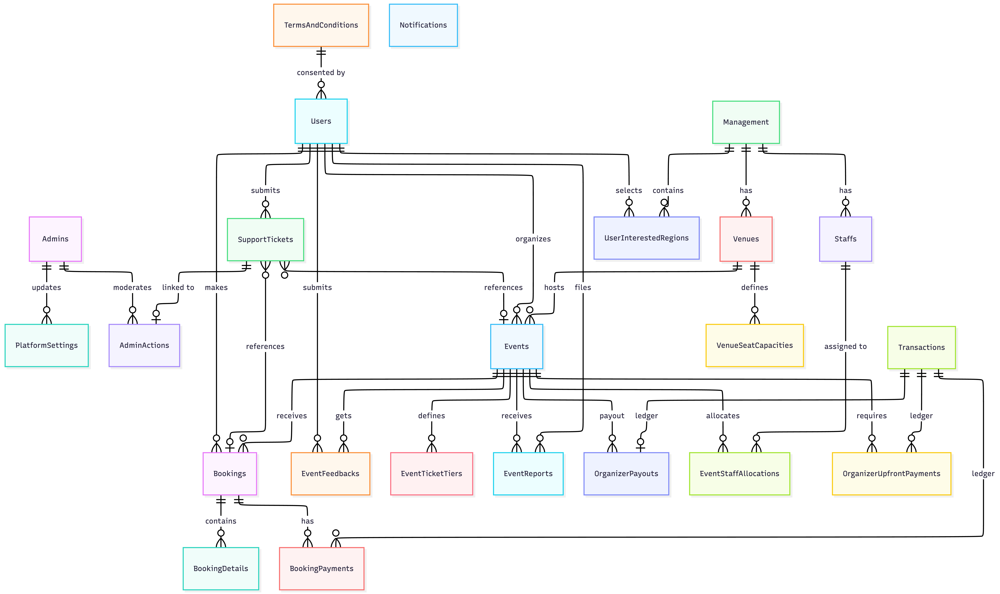

# Event Management Platform

A premium, high-performance event hosting, ticket booking, and ticketing management system built with **.NET 10.0**, **ASP.NET Core Web API**, and **PostgreSQL (Entity Framework Core)**. The platform provides comprehensive features for users (Attendees and Organizers), system administrators, and financial administrators, featuring automated QR ticket check-ins, automated staff allocation, role-bound login, and integrated Stripe payments.

---

## Project Architecture & Design

The project follows a decoupled **Client-Server architecture**, split into two main directories:

### 1. Frontend (`client/`)
Built with **Angular 18**, managing a rich, dynamic, and responsive user interface.
*   **Authentication & State**: Implements role-based routing guards (Admin, Finance, User) and JWT interceptors.
*   **Component Modularity**: Isolated portals for User Dashboard, Organizer Management, Finance Escalations, and Admin Helpdesk.
*   **Payments**: Integrates `ngx-stripe` for seamless, PCI-compliant checkout flows.
*   **Design**: Custom-built CSS design system featuring premium micro-animations and "glassmorphism" aesthetics.

### 2. Backend (`server/`)
Built with **ASP.NET Core Web API**, structured following clean architecture guidelines:
*   **Event.API**: The API endpoints, validation logic, request/response models, and route mappings.
*   **Event.Business**: The service layer hosting the core domain logic, exceptions, transaction handling, helper services, and background workers.
*   **Event.Contracts**: Interface definitions for repositories and services to maintain loose coupling.
*   **Event.Data**: Database access repositories, migrations, and PostgreSQL DbContext configuration.
*   **Event.Models**: Shared entity definitions, DTO schemas, and model binding definitions.

### Technical Stack:
*   **Frontend**: Angular 18, TypeScript, HTML5, Vanilla CSS, ngx-stripe
*   **Backend Framework**: .NET 10.0 (C#)
*   **Database**: PostgreSQL
*   **Caching Layer**: Redis Cache (via StackExchange)
*   **Payment Gateway**: Stripe
*   **Email Engine**: Brevo SMTP Integration
*   **Testing Suite**: NUnit, Coverlet, Moq (Backend) / Jasmine, Karma, Vitest (Frontend)

### Highlights of Recent Updates:
*   **Single Interested Region**: Refactored the user interested region preference from a list/collection to a single `RegionId` string, simplifying onboarding.
*   **Public Regions Discovery**: Added a public `/api/regions` endpoint, allowing the frontend client to query the list of active operating regions without needing user authentication (e.g., for location-based landing pages).
*   **Organizer Created Events Retrieval**: Exposes two new routes under `UserController`: `GET /api/user/my-events` (which returns a non-sensitive overview of events created by the logged-in organizer) and `GET /api/user/my-events/{eventId}` (which returns the full event details, including Jitsi meeting URLs and passcode hashes).
*   **Bookings Filtering by Status**: Added a `status` query parameter to the `GET /api/booking` endpoint, allowing users to filter their bookings list by status (`Confirmed` or `Cancelled`).
*   **Hybrid/Virtual Event Details & Booking Response**: Updated booking confirmation and retrieval flows to share virtual meeting URLs (`Virtual_Url`) and meeting passcode hashes (`Virtual_Password_Hash`) with the attendee once their booking is confirmed.
*   **Automated Email Credentials**: When a hybrid/virtual event is booked, the booking engine now automatically emails the attendee with the meeting link and the raw (unhashed) passcode.

---

## Database Schema Details

The database is built on **PostgreSQL** using Entity Framework Core. Specific sequences start IDs at **10000** for all primary keys (excluding transactions, which utilize a 16-digit sequence starting at `1000000000000000`) to guarantee uniform 5-digit entity tracking.

#### Entity Relationship Diagram (ERD)

## Database Schema


### Table Definitions & Key Constraints
1. **Users (`"Users"`)**: Attendee and Organizer accounts. Key fields: `User_Id` (PK), `Email` (Unique), `Password_Hash`, `Consented_Terms_Id` (FK to `"TermsAndConditions"`), `Status` (Active, Restricted, Deactivated).
2. **Admins (`"Admins"`)**: Platform staff accounts. Key fields: `Admin_Id` (PK - starts with `ADM` or `FIN`), `Email`, `Password_Hash`.
3. **Regions (`"Management"`)**: Regional operational centers. Key fields: `Region_Id` (PK), `Region_Name`, `No_Of_Staffs`.
4. **User Interested Regions (`"UserInterestedRegions"`)**: Preferred regions of users. Key fields: `(User_Id, Region_Id)` (Composite PK / FKs to `"Users"` and `"Management"`).
5. **Staffs (`"Staffs"`)**: Regional support staff. Key fields: `Employee_ID` (PK), `Name`, `Email`, `Region_Id` (FK to `"Management"`), `IsAllocated`.
6. **Event Staff Allocations (`"EventStaffAllocations"`)**: Support staff assigned to events. Key fields: `(Event_Id, Employee_ID)` (Composite PK / FKs to `"Events"` and `"Staffs"`).
7. **Venues (`"Venues"`)**: Physical event hosting spaces. Key fields: `Venue_Id` (PK), `Region_Id` (FK to `"Management"`), `Hourly_Price`.
8. **Venue Seat Capacities (`"VenueSeatCapacities"`)**: Seat limits per physical tier. Key fields: `(Venue_Id, Tier_Name)` (Composite PK / FK to `"Venues"`), `Total_Seats`.
9. **Events (`"Events"`)**: Scheduled events. Key fields: `Event_Id` (PK), `Organizer_Id` (FK to `"Users"`), `Venue_Id` (nullable FK to `"Venues"`), `Status` (Live, Pending, Cancelled, Completed, Failed).
10. **Event Ticket Tiers (`"EventTicketTiers"`)**: Prices and capacity per tier. Key fields: `(Event_Id, Tier_Name)` (Composite PK / FK to `"Events"`), `Price`, `Tickets_Sold`.
11. **Bookings (`"Bookings"`)**: Reservations. Key fields: `Booking_Id` (PK), `Attendee_Id` (FK to `"Users"`), `Event_Id` (FK to `"Events"`), `Booking_Status`, `Qr_Secret_Hash`, `CheckIn_Status`, `Virtual_Url`.
12. **Booking Details (`"BookingDetails"`)**: Quantities reserved per booking tier. Key fields: `(Booking_Id, Tier_Name)` (Composite PK / FK to `"Bookings"`), `Quantity`.
13. **Platform Settings (`"PlatformSettings"`)**: Global platform fees and limits. Key fields: `Settings_Id` (PK), `Staff_Flat_Rate`, `Ticket_Commission_Percentage`, `Updated_By_Admin_Id` (FK to `"Admins"`).
14. **Terms And Conditions (`"TermsAndConditions"`)**: Policy agreements. Key fields: `Terms_Id` (PK), `Version`, `Type` (General, EventCreation), `Is_Active`.
15. **Notifications (`"Notifications"`)**: Queued transactional outbound emails. Key fields: `Notification_Id` (PK), `Recipient_Email`, `Subject`, `Status` (Pending, Sent, Failed).
16. **Support Tickets (`"SupportTickets"`)**: Customer inquiries. Key fields: `Ticket_Id` (PK), `User_Id` (FK to `"Users"`), `ConcernUrl`, `RequestType`, `Status`, `EsclationStatus`, `RelatedId` (nullable FK to Event or Booking).
17. **Admin Actions (`"AdminActions"`)**: Record of support ticket escalations. Key fields: `ActionId` (PK), `AdminId` (FK to `"Admins"`), `TicketId` (nullable FK to `"SupportTickets"`), `ActionStatus`.
18. **Event Reports (`"EventReports"`)**: Event flags and policy violations. Key fields: `Report_Id` (PK), `Event_Id` (FK to `"Events"`), `Reporter_Id` (FK to `"Users"`), `ResponseAction`.
19. **Event Feedback (`"EventFeedbacks"`)**: Attendee reviews and ratings. Key fields: `Feedback_Id` (PK), `Event_Id` (FK to `"Events"`), `Attendee_Id` (FK to `"Users"`), `Rating`, `Review`.
20. **Transactions (`"Transactions"`)**: Double-entry financial audit ledger. Key fields: `Transaction_Id` (PK), `Sender_Id`, `Receiver_Id`, `Transaction_Type`, `Amount`, `Related_Id` (Event or Booking ID), `Status`.
21. **Booking Payments (`"BookingPayments"`)**: Payment records for booking transactions. Key fields: `Booking_Payment_Id` (PK), `Booking_Id` (FK to `"Bookings"`), `Transaction_Id` (FK to `"Transactions"`), `Platform_Fee_Cut`, `Payment_Status`.
22. **Organizer Upfront Payments (`"OrganizerUpfrontPayments"`)**: Payment records for event activation. Key fields: `Upfront_Payment_Id` (PK), `Event_Id` (FK to `"Events"`), `Transaction_Id` (FK to `"Transactions"`), `Payment_Status`.
23. **Organizer Payouts (`"OrganizerPayouts"`)**: Payout records for ticket sales. Key fields: `Payout_Id` (PK), `Event_Id` (FK to `"Events"`), `Transaction_Id` (nullable FK to `"Transactions"`), `Payout_Amount`, `Payout_Status`.

---

## Service Layer Responsibilities (Event.Business)

The service layer contains the foundational business workflows of the application:

*   **`UserAuthService`**: Handles user authentication, hashes password entries using PBKDF2 SHA256, verifies OTP caches, and enforces that registration requires consent to the activeTerms.
*   **`DeptAuthService`**: Handles Admin and Finance logins. Implements multi-factor authentication (OTP) for accounts starting with the `FIN` prefix.
*   **`EventService`**: Validates event details, physical boundaries, checks and schedules virtual meetings, checks staff regional counts, and updates event state status.
*   **`BookingService`**: Orchestrates ticket reservations, checks remaining capacity in real-time, processes payments via Stripe integrations, generates custom QR check-in hashes, and manages check-in state.
*   **`RefundService`**: Contains cancellation calculations to compute dynamic refunds (e.g. 100% refund for cancellations > 48h before event, 50% refund for 24h-48h, and 0% refund for < 24h).
*   **`FinanceService`**: Aggregates billing records, executes payout commands to organizers, reviews escalated disputes, and processes refund allocations.
*   **`SupportService`**: Submits and processes user tickets, escalates items to administrators, and registers resolutions.
*   **`BackgroundService`**: A hosted worker executing periodically to:
    1. Revert ticket reservations that remained in "Pending Payment" status for more than 15 minutes.
    2. Clean up expired temporary tokens and OTP caches.

---

## Local Setup & Configuration Instructions

Follow these steps to set up the project locally. You will need to run the backend and frontend simultaneously in separate terminals.

### 1. Prerequisites
Ensure the following are installed:
*   [.NET 10 SDK](https://dotnet.microsoft.com/en-us/download/dotnet/10.0)
*   [Node.js (v18+) & npm](https://nodejs.org/)
*   [Angular CLI](https://angular.dev/tools/cli) (`npm install -g @angular/cli`)
*   [PostgreSQL Database Server](https://www.postgresql.org/)
*   [Redis Cache Server](https://redis.io/)

### 2. Backend Setup (`server/`)
1. Open `server/Event.API/appsettings.json` and set up your connections:
   ```json
   {
     "ConnectionStrings": {
       "DefaultConnection": "Host=localhost;Database=event_management_db;Username=YOUR_USERNAME;Password=YOUR_PASSWORD",
       "Redis": "localhost:6379"
     },
     "Jwt": {
       "SecretKey": "YOUR_SUPER_SECRET_KEY_MUST_BE_AT_LEAST_32_CHARACTERS",
       "Issuer": "EventPlatform",
       "Audience": "EventPlatformUsers"
     },
     "Stripe": {
       "SecretKey": "sk_test_..."
     }
   }
   ```
2. Apply EF Core migrations to generate the database schema:
   ```bash
   cd server
   dotnet ef database update --project Event.Data --startup-project Event.API
   ```
3. *(Optional)* Run the database seeder if you want dummy data:
   ```bash
   dotnet run --project Event.API seed
   ```
4. Start the API server:
   ```bash
   dotnet run --project Event.API
   ```
   *The backend will run on `http://localhost:5106`.*

### 3. Frontend Setup (`client/`)
1. Navigate to the frontend directory and install dependencies:
   ```bash
   cd client
   npm install
   ```
2. Open `client/src/environments/environment.ts` and verify the backend API URL is pointing to your active .NET server:
   ```typescript
   export const environment = {
     production: false,
     apiUrl: 'http://localhost:5106/api',
     serverUrl: 'http://localhost:5106'
   };
   ```
3. Start the Angular development server:
   ```bash
   ng serve
   ```
   *The frontend will run on `http://localhost:4200`.*

### 4. Exposing to the Internet (Optional)
If you need to test Webhooks or share the application with external users, you can use **Cloudflare Tunnels** or **ngrok** to safely expose both ports:
```bash
# Terminal 1 (Backend)
cloudflared tunnel --url http://localhost:5106

# Terminal 2 (Frontend)
cloudflared tunnel --url http://localhost:4200
```
*(Remember to update `environment.ts` with your new backend tunnel URL!)*

---

## Unit Test Execution & Code Coverage

Our comprehensive test suite validates all critical paths, mocking DB adapters and Stripe integration nodes to ensure reliable test execution.

### Test Run Summaries

*   **Business Layer Tests (`Event.Business.Tests.dll`)**:
    ```text
    Passed!  - Failed:     0, Passed:   206, Skipped:     0, Total:   206, Duration: 27 s - Event.Business.Tests.dll (net10.0)
    ```
*   **Data Layer Tests (`Event.Data.Tests.dll`)**:
    ```text
    Passed!  - Failed:     0, Passed:    96, Skipped:     0, Total:    96, Duration: 3.0 s - Event.Data.Tests.dll (net10.0)
    ```

### Detailed Test Logs

> [!IMPORTANT]
> Detailed test reports are written directly to file structures checked into git control:
> *   [server/Event.Business.Tests/test_results.log](server/Event.Business.Tests/test_results.log) (Detailed NUnit execution log for service validation rules).
> *   [server/Event.Data.Tests/test_results.log](server/Event.Data.Tests/test_results.log) (Detailed NUnit execution log for repository integrations).
> 
> When committing edits, please verify these log files are updated cleanly to represent the state of verification records. Ensure no sensitive passwords or private API key parameters are printed in these log files as they are pushed to GitHub.

### Coverage Report Table
The coverage metrics generated using `coverlet` and `dotnet test` are summarized below:

| Module | Line Coverage | Branch Coverage | Method Coverage |
| :--- | :--- | :--- | :--- |
| **Event.Models** | **82.58%** | **16.66%** | **83.74%** |
| **Event.Data** | 0% | 0% | 0% |
| **Event.Business** | **92.54%** | **81.15%** | **96.00%** |
| **Event.Contracts** | 100% | 100% | 100% |
| **Total** | **9.77%** | **74.66%** | **65.49%** |
| **Average** | **68.78%** | **49.45%** | **69.94%** |

> [!NOTE]
> `Event.Data` registers 0% coverage because the database repositories rely on concrete PostgreSQL instances, which are excluded from standard Business logic unit tests to preserve test execution speeds.

---

### Why `Event.Business` is at ~92.5% (Not 100%)

While all critical code paths are thoroughly validated, achieving 100% coverage is restricted by defensive infrastructure constraints:

1.  **Network and Gateway Catch Blocks**:
    *   `StripePaymentService.cs` and `EmailService.cs` communicate with remote APIs (Stripe and Brevo). Exceptions related to network dropouts, socket timeouts, and API rate-limiting are bypassed as mock interceptors handle the test paths.
2.  **Infinite Background Loops**:
    *   The hosted `BackgroundService` runs continuously on background loops using `Task.Delay`. Invoking these loops directly in tests would cause the test harness to hang indefinitely.
3.  **Unreachable Defensive Guard Clauses**:
    *   Many service-level validation statements check for null parameters that are resolved earlier or guaranteed by database seeding configurations. For instance, the registration guard check `if (activeTerms == null)` will never fire in tests since active terms are seeded during DB setup.
4.  **Catch Blocks for Malformed Encodings**:
    *   The exception catch statement in `PasswordHasher.Verify` only runs if it receives base64 string inputs that are completely corrupted. Standard test cases pass clean strings, keeping these lines from firing.

---

## Roadmap & Future Upgrades

1.  **Stripe Webhooks**: Replace manual API payment check-ins with automated Stripe Webhook events (`payment_intent.succeeded` and `payment_intent.failed`) to improve security.
2.  **Real-Time Notifications**: Integrate SignalR / WebSockets to provide attendees and administrators with instant notifications upon booking approvals, ticket check-ins, or cancellations.
3.  **Advanced Analytics Dashboard**: Introduce visual metrics charts (e.g. daily booking volumes, regional event density mapping, and revenue progression) using Postman Flows or Grafana.
4.  **Elasticsearch Event Engine**: Implement indexed searches for the `/api/event` endpoint to allow deep full-text keyword searches across large-scale event lists.
5.  **Multi-Venue Capacity Checks**: Support booking flows checking for seat allocations across hybrid events (simultaneously tracking physical seat boundaries and virtual connection capacities).
