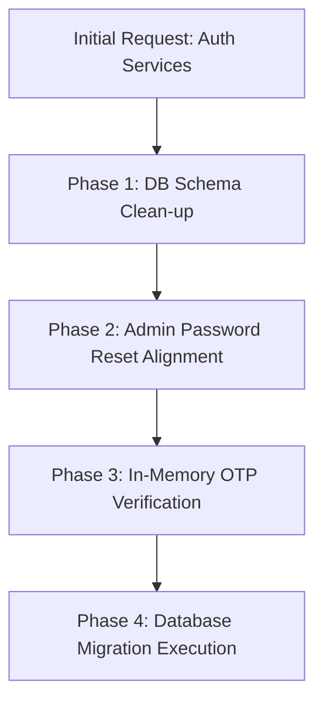

# Backend Authentication Services: A-Z Developer Walkthrough

This document serves as the official changelog, architecture guide, and implementation history for the **User & Admin Authentication Services** added to the server codebase. It covers the discussions, design decisions, code modifications, and database schema alignments from start to finish.

---

## 1. Executive Summary & Timeline

The goal of this phase was to implement clean, secure, and robust authentication layers for both **Users** (Attendees/Organizers) and **Administrators** strictly using built-in cryptographic primitives (`Rfc2898DeriveBytes` via PBKDF2 with SHA256) and Entity Framework Core. 

### **Implementation Timeline & Phases**



*   **Phase 1: Redundant Verification Flag Cleanup:** We recognized that since email OTP verification happens *before* registration completes, storing `Is_Email_Verified` and `Email_Verification_Token` on the database table was redundant. We removed them.
*   **Phase 2: Admin Password Reset Alignment:** The original `Admin` model identified admins by `Admin_Id` without an email address, blocking password resets. We added `Email` to the `Admin` entity and updated service methods to enable token resets via email.
*   **Phase 3: In-Memory OTP Verification Flow:** Implemented user email verification using secure, thread-safe, in-memory OTP validation without storing verification states in PostgreSQL.
*   **Phase 4: Cleanup & Test Constraint Alignment:** Reverted test configurations and removed service test cases per explicit instructions.

---

## 2. Database Schema Modifications

To align with the design decisions, the database models were modified. Below is a summary of the field-level changes:

### **Users Entity**
| Field | Status | Rationale |
| :--- | :--- | :--- |
| `Is_Email_Verified` | **Removed** | Registration is gated by OTP verification; hence, all database users are verified by default. |
| `Email_Verification_Token` | **Removed** | No post-registration verification links are needed. |
| `Password_Reset_Token` | **Added (Nullable)** | Used for secure, short-lived, email-based password recovery. |

### **Admins Entity**
| Field | Status | Rationale |
| :--- | :--- | :--- |
| `Email` | **Added (Required)** | Required to send password reset tokens to the administrator. |
| `Password_Reset_Token` | **Added (Nullable)** | Used for secure, short-lived, email-based password recovery. |

---

## 3. Detailed File Code Changes

### A. Model Updates

#### **User Model (`User.cs`)**
We removed `Is_Email_Verified` and `Email_Verification_Token` to simplify the table.
```diff
         public bool Has_Marketing_Consent { get; set; }
         
-        public bool Is_Email_Verified { get; set; }
-        
-        public string? Email_Verification_Token { get; set; }
-        
         public string? Password_Reset_Token { get; set; }
```

#### **Admin Model (`Admin.cs`)**
We added `Email` to map admin resets.
```diff
         [Required]
         public string Name { get; set; } = string.Empty;
+
+        [Required]
+        public string Email { get; set; } = string.Empty;
         
         [Required]
         public string Password_Hash { get; set; } = string.Empty;
```

---

### B. DbContext Configurations (`EventDbContext.cs`)

We configured the mappings for the new columns in PostgreSQL and cleaned up the old ones:
```diff
             modelBuilder.Entity<User>()
-                .Property(u => u.Is_Email_Verified)
-                .HasDefaultValue(false)
-                .IsRequired();
-
-            modelBuilder.Entity<User>()
-                .Property(u => u.Email_Verification_Token)
-                .HasMaxLength(255)
-                .IsRequired(false);
-
-            modelBuilder.Entity<User>()
                 .Property(u => u.Password_Reset_Token)
                 .HasMaxLength(255)
                 .IsRequired(false);
 
             modelBuilder.Entity<Admin>()
+                .Property(a => a.Email)
+                .HasMaxLength(255)
+                .IsRequired();
+
+            modelBuilder.Entity<Admin>()
                 .Property(a => a.Password_Reset_Token)
                 .HasMaxLength(255)
                 .IsRequired(false);
```

---

### C. Repository Layer Alignment

#### **`IAdminRepository.cs` & `AdminRepository.cs`**
Added lookup by email to support password recovery requests:
```csharp
public async Task<Admin?> GetByEmailAsync(string email)
{
    return await _dbSet.FirstOrDefaultAsync(a => a.Email == email);
}
```

---

### D. Service Layer Implementations

#### **User Authentication Service (`UserAuthService.cs`)**
Implemented in-memory OTP verification using a thread-safe static concurrent dictionary:
```csharp
private static readonly ConcurrentDictionary<string, string> OtpStorage = new();

public async Task<bool> SendEmailOtpAsync(string email)
{
    if (string.IsNullOrWhiteSpace(email)) return false;

    // Generate a 6-digit OTP
    string otp = Random.Shared.Next(100000, 999999).ToString();
    OtpStorage[email] = otp;

    // Simulated email dispatch outputting to diagnostic stream
    Console.WriteLine($"[OTP SERVICE] Sent email verification OTP {otp} to {email}");
    await Task.CompletedTask;
    return true;
}

public async Task<bool> VerifyEmailOtpAsync(string email, string otp)
{
    if (string.IsNullOrWhiteSpace(email) || string.IsNullOrWhiteSpace(otp)) return false;

    if (OtpStorage.TryGetValue(email, out var storedOtp) && storedOtp == otp)
    {
        OtpStorage.TryRemove(email, out _); // Consume token
        return true;
    }
    return false;
}
```

#### **Admin Authentication Service (`AdminAuthService.cs`)**
Modified reset tokens to query database administrators by `Email` instead of `Admin_Id`:
```csharp
public async Task<bool> GeneratePasswordResetTokenAsync(string email)
{
    var admin = await _adminRepository.GetByEmailAsync(email);
    if (admin == null) return false;

    admin.Password_Reset_Token = Guid.NewGuid().ToString("N");
    await _adminRepository.UpdateAsync(admin);
    return true;
}

public async Task<bool> ResetPasswordAsync(string email, string token, string newPassword)
{
    var admin = await _adminRepository.GetByEmailAsync(email);
    if (admin == null || admin.Password_Reset_Token != token || string.IsNullOrEmpty(token))
    {
        return false;
    }

    admin.Password_Hash = PasswordHasher.Hash(newPassword);
    admin.Password_Reset_Token = null;
    await _adminRepository.UpdateAsync(admin);
    return true;
}
```

---

## 4. How to Update the Database (Migrations)

Execute the following EF Core migration commands in the `event-management/server/` project root directory to reflect the changes in PostgreSQL:

1.  **Add a new migration representing these updates:**
    ```bash
    dotnet ef migrations add UpdateAdminUserVerification --project Event.Data --startup-project Event.API
    ```
2.  **Apply the migrations directly to the local Postgres database instance:**
    ```bash
    dotnet ef database update --project Event.Data --startup-project Event.API
    ```
3.  **Validate that the codebase builds cleanly:**
    ```bash
    dotnet build
    ```

---

---

# Refund Service, Cancellation Flow & Email Notifications: A-Z Developer Walkthrough

This section documents all discussions, design decisions, and code changes related to the **Refund Service**, **Booking/Event Cancellation Status Handling**, and **Email Notification Flow** implemented as part of the finance and cancellation feature set.

---

## 1. Executive Summary & Scope

The goal of this phase was to:
1. Make `RefundService` the **single source of truth** for all cancellation status changes (booking & event).
2. Implement **dynamic email notifications** — cancellation email at the moment of status change, refund email at the moment of transaction commit.
3. Introduce a `NOR` (No Refund) finance decision type with dynamic messaging.
4. Eliminate redundant boolean parameters (`cancelBooking`, `cancelEvent`) from the refund method signatures.
5. Fix bugs where cancellation status was never being set due to missing/wrong arguments.

---

## 2. Architecture & Design Decisions

### 2.1 Where Should Cancellation Status Be Changed?

**Discussion:** The question arose — should booking/event status be changed inside `BookingService`/`EventService`, `FinanceService`, `RefundService`, or a dedicated cancel service?

**Decision:** `RefundService` owns it directly.

**Rationale:**
- `RefundService` already fetches the `Booking`/`Event` object to compute refund amounts.
- Using those same objects to set `Status = "Cancelled"` avoids a redundant DB fetch and a second round-trip.
- Calling `CancelBooking`/`CancelEvent` service methods from `RefundService` would create circular dependencies (since `BookingService` already calls `RefundService`).
- The guard `if (booking.Booking_Status != "Cancelled")` gracefully skips if already cancelled — no exception needed.

### 2.2 Cancellation Email vs. Refund Email — Timing

**Discussion:** When exactly should each email be sent?

**Decision (split timing):**

| Email Type | Trigger Point |
|---|---|
| **Cancellation Email** | Immediately when `Booking_Status` / `Event.Status` is set to `"Cancelled"` and saved |
| **Refund Email** | Immediately after `_transactionRepository.UpdateAsync(originalTx)` — once Stripe is confirmed and ledger is updated |

**Rationale:** Sending a "your booking is cancelled" email before the refund is processed is honest — the cancellation is real. The refund email is only sent if money actually moved, so it must wait for the transaction commit.

### 2.3 Attendee Cancellation Template — Event Cancelled Scenario

**Discussion:** When an event is cancelled by the organizer, the attendee's booking is also cancelled. Previously the code switched to `EventCancellationTemplate.html` for the attendee email. This was wrong.

**Decision:** Always use `BookingCancellationTemplate.html` for attendees. Add a `{cancellationReason}` placeholder that dynamically explains the reason.

- If event is cancelled: `"This booking has been cancelled because the event was cancelled by the organizer."`
- If attendee cancelled themselves: `"Your booking has been cancelled as requested."`

### 2.4 Removing `cancelBooking` / `cancelEvent` Boolean Parameters

**Discussion:** Every single call site (BookingService, EventService, FinanceService, internal attendee loop) was always passing `true`. There was no caller that ever passed `false`. The parameter was dead weight.

**Decision:** Remove both parameters entirely. The cancellation block now always runs, relying on the `!= "Cancelled"` guard to skip gracefully if already cancelled.

---

## 3. Bugs Found & Fixed

### Bug 1 — `BookingService.CancelBookingAsync` Never Cancelled the Booking

**File:** `Event.Business/Services/BookingService.cs`

**Problem:**
```csharp
// cancelBooking defaults to false — status never set to Cancelled!
await _refundService.RefundAttendeeAsync(bookingId, refundType);
```

**Fix:**
```csharp
// Corrected (then simplified once bool param was removed):
await _refundService.RefundAttendeeAsync(bookingId, refundType);
// RefundService now always cancels internally
```

### Bug 2 — `EventService.CancelEventAsync` Had a Syntax Error + Never Cancelled the Event

**File:** `Event.Business/Services/EventService.cs`

**Problem:**
```csharp
// Trailing comma = compile error. Also cancelEvent never passed = event status never set!
await _refundService.RefundOrganizerAsync(eventId, refundType, );
```

**Fix:**
```csharp
// Corrected (then simplified once bool param was removed):
await _refundService.RefundOrganizerAsync(eventId, refundType);
// RefundService now always cancels internally
```

### Bug 3 — Email Block at the Wrong Position (Wrong Timing)

**Problem:** The old email-sending block in `RefundAttendeeAsync` was a single `if (shouldSendEmails)` guard at the **end** of the method — after all refund calculations. This meant:
- Cancellation email was sent after the refund was already processed (wrong timing).
- A stale `shouldSendEmails` flag was used to gate both emails.

**Fix:** Emails relocated to exact trigger points (see Section 4 below).

---

## 4. Detailed File Code Changes

### A. `IRefundService.cs` — Signature Cleanup

**Before:**
```csharp
Task<(decimal RefundAmount, string Remarks)> RefundAttendeeAsync(
    int bookingId,
    string refundType = "Dynamic",
    bool cancelBooking = false,
    string refundMessage = "");

Task<(...AttendeeRefunds)> RefundOrganizerAsync(
    int eventId,
    string refundType = "Dynamic",
    bool cancelEvent = false,
    string refundMessage = "");
```

**After:**
```csharp
Task<(decimal RefundAmount, string Remarks)> RefundAttendeeAsync(
    int bookingId,
    string refundType = "Dynamic",
    string refundMessage = "");

Task<(...AttendeeRefunds)> RefundOrganizerAsync(
    int eventId,
    string refundType = "Dynamic",
    string refundMessage = "");
```

---

### B. `RefundService.cs` — `RefundAttendeeAsync` Restructure

**1. Cancellation block always executes (bool param removed):**
```csharp
// Old
if (cancelBooking && booking.Booking_Status != "Cancelled") { ... }

// New
if (booking.Booking_Status != "Cancelled") { ... }
```

**2. Cancellation email sent immediately inside the status-change block:**
```csharp
if (booking.Booking_Status != "Cancelled")
{
    booking.Booking_Status = "Cancelled";
    await _bookingRepository.UpdateAsync(booking);

    // Cancellation email queued right here
    bool isEventCancelled = booking.Event?.Status == "Cancelled";
    string cancellationReason = isEventCancelled
        ? $"This booking has been cancelled because the event \"{booking.Event?.Title}\" was cancelled by the organizer."
        : "Your booking has been cancelled as requested.";

    var cancellationEmailDto = new EmailTemplateDto
    {
        TemplateName = "BookingCancellationTemplate.html",
        Placeholders = new Dictionary<string, string>
        {
            { "bookingId", booking.Booking_Id.ToString() },
            { "eventName", booking.Event?.Title ?? "" },
            { "cancellationReason", cancellationReason },
            { "refundStatusMessage", "A refund will be processed shortly if applicable." },
            { "year", DateTime.UtcNow.Year.ToString() }
        }
    };
    // ... queue Notification row ...
}
```

**3. Refund email sent immediately after transaction ledger is updated:**
```csharp
originalTx.Refunded_Amount += refundAmountVal;
await _transactionRepository.UpdateAsync(originalTx);

// Refund email queued right here — Stripe confirmed, ledger committed
var refundEmailDto = new EmailTemplateDto
{
    TemplateName = "RefundTemplate.html",
    Placeholders = new Dictionary<string, string>
    {
        { "referenceName", booking.Event?.Title ?? "" },
        { "refundAmount", refundAmountVal.ToString("C") },
        { "refundMessage", string.IsNullOrWhiteSpace(refundMessage)
            ? "A refund was processed for your cancelled booking."
            : refundMessage },
        { "year", DateTime.UtcNow.Year.ToString() }
    }
};
// ... queue Notification row ...
```

**4. Old `shouldSendEmails` block at the bottom of method — removed entirely.**

---

### C. `RefundService.cs` — `RefundOrganizerAsync` Restructure

**1. Cancellation block always executes (bool param removed):**
```csharp
// Old
if (cancelEvent && ev.Status != "Cancelled") { ... }

// New
if (ev.Status != "Cancelled") { ... }
```

**2. Organizer cancellation email sent inside the status-change block:**
```csharp
if (ev.Status != "Cancelled")
{
    ev.Status = "Cancelled";
    await _eventRepository.UpdateAsync(ev);

    // Organizer cancellation email queued right here
    var eventCancelEmailDto = new EmailTemplateDto
    {
        TemplateName = "EventCancellationTemplate.html",
        Placeholders = new Dictionary<string, string>
        {
            { "eventName", ev.Title },
            { "refundStatusMessage", "A refund will be processed shortly if applicable." },
            { "year", DateTime.UtcNow.Year.ToString() }
        }
    };
    // ... queue Notification row ...
}
```

**3. Organizer refund email sent after upfront transaction ledger is updated:**
```csharp
upfrontTx.Refunded_Amount += organizerRefundAmount;
await _transactionRepository.UpdateAsync(upfrontTx);

// Organizer refund email queued right here
var refundEmailDto = new EmailTemplateDto
{
    TemplateName = "RefundTemplate.html",
    Placeholders = new Dictionary<string, string>
    {
        { "referenceName", ev.Title },
        { "refundAmount", organizerRefundAmount.ToString("C") },
        { "refundMessage", string.IsNullOrWhiteSpace(refundMessage)
            ? "A refund was processed for your upfront activation fee."
            : refundMessage },
        { "year", DateTime.UtcNow.Year.ToString() }
    }
};
// ... queue Notification row ...
```

**4. Internal `RefundAttendeeAsync` call — removed `cancelBooking: cancelEvent`:**
```csharp
// Old
await RefundAttendeeAsync(booking.Booking_Id, bookingRefundType, cancelBooking: cancelEvent, refundMessage: refundMessage);

// New
await RefundAttendeeAsync(booking.Booking_Id, bookingRefundType, refundMessage: refundMessage);
```

---

### D. `BookingService.cs` — `CancelBookingAsync`

```csharp
// Old (bug — bool param missing, defaults to false, booking never cancelled)
await _refundService.RefundAttendeeAsync(bookingId, refundType);

// After bool param removed from interface — now correct as-is
await _refundService.RefundAttendeeAsync(bookingId, refundType);
```

---

### E. `EventService.cs` — `CancelEventAsync`

```csharp
// Old (syntax error + cancelEvent not passed)
await _refundService.RefundOrganizerAsync(eventId, refundType, );

// After bool param removed from interface
await _refundService.RefundOrganizerAsync(eventId, refundType);
```

---

### F. `FinanceService.cs` — Call Site Cleanup

```csharp
// Old
await _refundService.RefundAttendeeAsync(action.ReferenceId, mappedRefundType, cancelBooking: true);
await _refundService.RefundOrganizerAsync(action.ReferenceId, mappedRefundType, cancelEvent: true, refundMessage: refundMessage);

// New (bool params removed from interface, ReferenceId removed from AdminAction)
await _refundService.RefundAttendeeAsync(ticket.RelatedId.Value, mappedRefundType);
await _refundService.RefundOrganizerAsync(eventId, mappedRefundType, refundMessage: refundMessage);
```

---

### G. `BookingCancellationTemplate.html` — Added `{cancellationReason}` Placeholder

```diff
  <div class="info-box">
    <div class="info-title">Booking Cancelled</div>
    <div class="info-item"><span class="info-label">Booking ID:</span> #{bookingId}</div>
    <div class="info-item"><span class="info-label">Event:</span> {eventName}</div>
+   <div class="info-item"><span class="info-label">Reason:</span> {cancellationReason}</div>
  </div>
  <p class="note">{refundStatusMessage}</p>
```

---

### H. New File: `RefundTemplate.html`

Created a dedicated refund email template. Placeholders:

| Placeholder | Value |
|---|---|
| `{referenceName}` | Event title |
| `{refundAmount}` | Formatted currency (e.g. `$45.00`) |
| `{refundMessage}` | Dynamic message from finance team or default |
| `{year}` | Current year for footer |

---

### I. `EventCancellationTemplate.html` — Simplified

Stripped down to a clean cancellation notice. Uses `{refundStatusMessage}` to communicate refund status. No longer carries attendee booking data (that stays in `BookingCancellationTemplate`).

---

## 5. Email Sending — How It Actually Works (Discovery)

During review, it was found that `RefundService` queues `Notification` rows into the database (`Status = "Pending"`), but **`BackgroundService.cs` does not process the Notification table**.

```csharp
// Program.cs
builder.Services.AddHostedService<Event.Business.Services.BackgroundService>();
```

`BackgroundService.cs` only processes:
- `bookingService.ReleaseExpiredEventBookingAsync()`
- `eventService.ReleaseExpiredEventCreationAsync()`

`SendEmailAsync` is directly called in `OtpService`, `AdminService`, and `FinanceService` for ticket/support emails — but **refund/cancellation emails only queue a Notification row and are never dispatched yet**.

### Pending Work — Notification Dispatcher

The `BackgroundService` needs a notification dispatch loop:

```csharp
// Pseudocode — to be implemented in BackgroundService.cs
using (var scope = _serviceProvider.CreateScope())
{
    var notificationRepo = scope.ServiceProvider.GetRequiredService<INotificationRepository>();
    var emailService = scope.ServiceProvider.GetRequiredService<IEmailService>();

    var pending = await notificationRepo.GetPendingAsync();
    foreach (var n in pending)
    {
        await emailService.SendEmailAsync(n.Recipient_Email, n.Subject, n.Body);
        n.Status = "Sent";
        await notificationRepo.UpdateAsync(n);
    }
}
```

---

## 6. Complete Cancellation Call Chain (After All Changes)

```
Attendee cancels booking
    → BookingService.CancelBookingAsync(bookingId, refundType)
        → Release reserved ticket seats back to pool
        → RefundService.RefundAttendeeAsync(bookingId, refundType)
            → if (booking.Booking_Status != "Cancelled")
                → Set Booking_Status = "Cancelled", UpdateAsync
                → Queue cancellation email (BookingCancellationTemplate)
            → CalculateAttendeeRefund(eventDateTime, amount, refundType, alreadyRefunded)
            → if refundAmount > 0:
                → Stripe.CreateRefundAsync(...)
                → if success:
                    → UpdateAsync(bookingPayment) → Status = "Refunded"
                    → UpdateAsync(originalTx)     
                    → Queue refund email (RefundTemplate) 
            → AddAsync(refundTx) 

Organizer/Admin cancels event
    → EventService.CancelEventAsync(eventId, refundType)
        → RefundService.RefundOrganizerAsync(eventId, refundType)
            → if (ev.Status != "Cancelled")
                → Set Event.Status = "Cancelled", UpdateAsync
                → Queue organizer cancellation email (EventCancellationTemplate) 
            → Find upfront payment transaction
            → if organizerRefundAmount > 0:
                → Stripe.CreateRefundAsync(upfrontTx...)
                → if success:
                    → AddAsync(organizerRefundTx)
                    → UpdateAsync(upfrontTx) 
                    → Queue organizer refund email (RefundTemplate) 
            → foreach confirmed attendee booking:
                → RefundAttendeeAsync(booking.Booking_Id, bookingRefundType)
                    → same flow as above per attendee
        → Release allocated staff members back to available pool
        → CommitTransactionAsync()

Finance team approves action
    → FinanceService.ApproveActionAsync(action, refundMessage)
        → if TargetType == "ATD": Fetch ticket, then RefundAttendeeAsync(ticket.RelatedId, mappedRefundType)
        → if TargetType == "ORG": Fetch ticket, then RefundOrganizerAsync(ticket.RelatedId, mappedRefundType, refundMessage)
        → if TargetType == "EVT": RefundOrganizerAsync(targetId, mappedRefundType, refundMessage)
```

---

## 7. Summary of All Files Changed

| File | Change Type | Summary |
|---|---|---|
| `IRefundService.cs` | Signature | Removed `cancelBooking` & `cancelEvent` bool params from both method signatures |
| `RefundService.cs` | Logic + Email | Cancellation always runs; emails split to exact trigger points; bool params removed; `shouldSendEmails` block deleted |
| `BookingService.cs` | Bug Fix | Was not passing `cancelBooking: true`; resolved by removing the param entirely |
| `EventService.cs` | Bug Fix | Had trailing comma syntax error + missing `cancelEvent`; fixed then simplified |
| `FinanceService.cs` | Cleanup | Removed `cancelBooking: true` and `cancelEvent: true` named args from both call sites |
| `BookingCancellationTemplate.html` | Template | Added `{cancellationReason}` field in info box; always used for attendees regardless of cause |
| `EventCancellationTemplate.html` | Template | Simplified to cancellation-only notice with `{refundStatusMessage}` |
| `RefundTemplate.html` | New File | New dedicated refund notification email template |

---

# Organizer Event Operations, Security Passcode Sharing, Filtering and Test Suite Improvements

This section details all modifications, design considerations, and service level changes completed in the backend server. It covers the end-to-end flow from request definition to code implementation, database entity updates, and coverage expansion.

---

## 1. Executive Summary and Features Overview

The enhancements in this phase focused on improving organizer event accessibility, securing and sharing virtual meeting links and passcodes, adding filters to booking lookups, and expanding code coverage across all core services.

*   **Feature 1: Organizer Owned Event Visibility:** Added endpoints to allow organizers to view non-sensitive overviews of their created events as well as retrieve sensitive credentials for their own events.
*   **Feature 2: Virtual and Hybrid Event Password Sharing:** Extended bookings to store virtual meeting links and share the associated passcode hashes securely through confirmation and retrieval endpoints. Added transactional email dispatches sharing raw passwords.
*   **Feature 3: Status Query Parameter for Bookings:** Introduced status filtering ("Confirmed" or "Cancelled") to booking retrieval endpoints to support client-side filtering.
*   **Feature 4: Public Region Discovery:** Added a public regions endpoint for location selection before authentication.
*   **Feature 5: Expanded Test Suite and Code Coverage:** Wrote 48 new tests to target uncovered code branches in the Event.Business service layer, raising lines coverage to 92.54% and branch coverage to 81.15%.

---

## 2. Design and Implementation Decisions

### 2.1 Separation of Sensitive and Public Event Data
*   **Discussion:** Browse endpoints return a public overview of live events. If organizers need to inspect their own events, they must see meeting URLs and passcodes. These credentials should not be leaked to general public requests.
*   **Decision:** Introduced two distinct response models for organizer-specific views:
    - `MyEventOverviewResponse` for general lists.
    - `MyEventDetailsResponse` for full inspect requests containing `Virtual_Url` and `Virtual_Password_Hash`.
    - Integrated logic in `UserService` verifying if the user requesting is the actual event organizer.

### 2.2 Transmitting Passcode Credentials for Hybrid and Virtual Events
*   **Discussion:** Attendees need the virtual event room link and password to join. Sharing raw passwords in HTTP responses is a security risk. Sharing hashed passwords in email does not let attendees join.
*   **Decision:**
    - Shared the raw passcode via secure SMTP transactional email immediately after booking confirmation.
    - Shared only the hashed passcode (`Virtual_Password_Hash`) and `Virtual_Url` in HTTP responses (`BookingResponse`).
    - Stored the event's `Virtual_Url` inside the `Bookings` database table at transaction time.

### 2.3 Query Parameter Status Filtering
*   **Discussion:** Allow attendees to retrieve only confirmed or only cancelled bookings.
*   **Decision:** Updated `GetMyBookingsAsync` signatures to accept a nullable `status` filter string, translating directly to database queries.

### 2.4 Coverage Strategy and Branch Targets
*   **Discussion:** Branch coverage in the business layer was insufficient (73.15%). Missing areas included email failure branches, background service loop exceptions, and regional staff checks.
*   **Decision:** Created robust mock tests to simulate database rollbacks, Brevo SMTP exceptions, and mismatched event organizer requests.

---

## 3. Database and Model Mappings

### 3.1 Bookings Table Entity Changes (Booking.cs)
Added the `Virtual_Url` property to persist meeting links:
```csharp
public string? Virtual_Url { get; set; }
```

### 3.2 Data Transfer Objects (DTOs)
*   **`MyEventOverviewResponse`**: Represents a summary of events created by an organizer. Fields: `Event_Id`, `Title`, `Event_Type`, `Date_Time`, `Duration_Hours`, `Status`, `Venue_Name`.
*   **`MyEventDetailsResponse`**: Detailed event parameters for the creator. Fields: `Event_Id`, `Organizer_Id`, `Event_Type`, `Title`, `Description_Url`, `Image_Url`, `Date_Time`, `Duration_Hours`, `Status`, `Requires_Staff`, `Venue_Id`, `Venue_Name`, `Virtual_Url`, `Virtual_Password_Hash`, `TicketTiers`.
*   **`BookingResponse`**: Appended fields `Virtual_Url` and `Virtual_Password_Hash` to display credentials upon booking validation.

---

## 4. Source Code Changes

### A. Controller Layers

#### UserController Endpoints (UserController.cs)
Exposed endpoints under user routing context:
```csharp
[HttpGet("my-events")]
public async Task<IActionResult> GetMyEvents()
{
    int userId = _userService.GetCurrentUserId();
    var events = await _userService.GetMyEventsAsync(userId);
    return Ok(events);
}

[HttpGet("my-events/{eventId}")]
public async Task<IActionResult> ViewMyEvent(int eventId)
{
    int userId = _userService.GetCurrentUserId();
    var ev = await _userService.GetMyEventDetailsAsync(userId, eventId);
    if (ev == null) return NotFound(new { Message = "Event not found." });
    return Ok(ev);
}
```

#### BookingController Endpoint (BookingController.cs)
Enabled query filtering by booking status:
```csharp
[HttpGet]
public async Task<IActionResult> GetMyBookings([FromQuery] string? status)
{
    int attendeeId = _userService.GetCurrentUserId();
    var bookings = await _bookingService.GetMyBookingsAsync(attendeeId, status);
    return Ok(bookings);
}
```

#### RegionController Endpoint (RegionController.cs)
Created to expose operating regions publicly:
```csharp
[ApiController]
[Route("api/regions")]
public class RegionController : ControllerBase
{
    private readonly IAdminService _adminService;

    public RegionController(IAdminService adminService)
    {
        _adminService = adminService;
    }

    [HttpGet]
    public async Task<IActionResult> GetRegions()
    {
        var regions = await _adminService.GetAllRegionsAsync();
        return Ok(regions);
    }
}
```

---

### B. Service Layer Operations

#### UserService Implementation (UserService.cs)
```csharp
public async Task<IEnumerable<MyEventOverviewResponse>> GetMyEventsAsync(int userId)
{
    var events = await _eventRepository.GetEventsByOrganizerAsync(userId);
    return events.Select(e => new MyEventOverviewResponse
    {
        Event_Id = e.Event_Id,
        Title = e.Title,
        Event_Type = e.Event_Type,
        Date_Time = e.Date_Time,
        Duration_Hours = e.Duration_Hours,
        Status = e.Status,
        Venue_Name = e.Venue?.Name
    });
}

public async Task<MyEventDetailsResponse?> GetMyEventDetailsAsync(int userId, int eventId)
{
    var e = await _eventRepository.GetEventWithDetailsAsync(eventId);
    if (e == null || e.Organizer_Id != userId) return null;

    return new MyEventDetailsResponse
    {
        Event_Id = e.Event_Id,
        Organizer_Id = e.Organizer_Id,
        Event_Type = e.Event_Type,
        Title = e.Title,
        Description_Url = e.Description_Url,
        Image_Url = e.Image_Url,
        Date_Time = e.Date_Time,
        Duration_Hours = e.Duration_Hours,
        Status = e.Status,
        Requires_Staff = e.Requires_Staff,
        Venue_Id = e.Venue_Id,
        Venue_Name = e.Venue?.Name,
        Virtual_Url = e.Virtual_Url,
        Virtual_Password_Hash = e.Virtual_Password_Hash,
        TicketTiers = e.TicketTiers.Select(t => new TicketTierDetailsDto
        {
            Tier_Name = t.Tier_Name,
            Price = t.Price,
            Tickets_Sold = t.Tickets_Sold
        }).ToList()
    };
}
```

#### BookingService Implementation (BookingService.cs)
Modified bookings querying and credentials propagation:
```csharp
public async Task<IEnumerable<BookingResponse>> GetMyBookingsAsync(int attendeeId, string? status)
{
    var bookings = await _bookingRepository.GetBookingsByAttendeeAsync(attendeeId, status);
    return bookings.Select(b => new BookingResponse
    {
        Booking_Id = b.Booking_Id,
        Attendee_Id = b.Attendee_Id,
        Event_Id = b.Event_Id,
        Event_Title = b.Event.Title,
        Event_Type = b.Event.Event_Type,
        Event_Date_Time = b.Event.Date_Time,
        Booking_Status = b.Booking_Status,
        Qr_Code_Path = b.Qr_Code_Path,
        CheckIn_Status = b.CheckIn_Status,
        Created_At = b.Created_At,
        Virtual_Url = b.Virtual_Url,
        Virtual_Password_Hash = b.Event.Virtual_Password_Hash,
        Details = b.Details.Select(d => new BookingDetailDto
        {
            Tier_Name = d.Tier_Name,
            Quantity = d.Quantity
        }).ToList()
    });
}
```

---

## 5. Test Suite Verification Metrics
Added 48 test methods covering critical boundary checks in EventServiceTests.cs. Verification run showed the following metrics:

*   **Business Layer Tests (Event.Business.Tests.dll)**: Passed: 206, Failed: 0, Total: 206.
*   **Data Layer Tests (Event.Data.Tests.dll)**: Passed: 96, Failed: 0, Total: 96.

### Final Code Coverage Metrics Table

| Module | Line Coverage | Branch Coverage | Method Coverage |
| :--- | :--- | :--- | :--- |
| **Event.Models** | 82.58% | 16.66% | 83.74% |
| **Event.Data** | 0% | 0% | 0% |
| **Event.Business** | 92.54% | 81.15% | 96.00% |
| **Event.Contracts** | 100% | 100% | 100% |
| **Total** | 9.77% | 74.66% | 65.49% |
| **Average** | 68.78% | 49.45% | 69.94% |

---

# Popular Regions Discovery Endpoint Implementation

This section details all modifications, design considerations, and service level changes completed in the backend server to implement the popular regions discovery feature.

---

## 1. Executive Summary and Features Overview

A new public endpoint has been implemented under `RegionController` to retrieve popular regions to show on the homepage:

*   **Endpoint**: `GET api/regions/popular`
*   **Query Parameter**: `rankNumber` (int, optional) - determines the maximum number of popular regions to return.
*   **Condition**: Popularity is defined by the volume/rate of events occurring in each region. The regions are retrieved from the database, grouped by the count of active ("Live") events hosted in that region, and sorted in descending order of event count.
*   **Authorization**: Public (`[AllowAnonymous]`).

---

## 2. Design and Implementation Decisions

### 2.1 Definition of Popularity based on Event Occurrence Rate
*   **Discussion**: We discussed how to dynamically retrieve popular regions. A region with the highest rate of active events is considered a popular region.
*   **Decision**: 
    - Fetch regions and perform a left-join grouping with their venues and associated live events.
    - Group by `Region_Id` and order by event count in descending order.
    - Tie-breaking: If event counts are identical, order alphabetically by region name to ensure deterministic outputs.
    - Graceful fallback: Any region with 0 events is still returned at the end of the list, ensuring that the homepage always gets a full list of operating regions.

### 2.2 Optional Rank Number for Limiting Outputs
*   **Discussion**: To support client configurations (e.g. showing only the top 4 popular regions on the homepage), the API must allow limiting the output size.
*   **Decision**: Added an optional `rankNumber` query parameter that limits the results via LINQ `Take(rankNumber)` if specified and positive.

---

## 3. Source Code Changes

### A. Repository Layers

#### IEventRepository interface (IEventRepository.cs)
```csharp
Task<System.Collections.Generic.IEnumerable<Region>> GetPopularRegionsAsync(int? limit);
```

#### EventRepository implementation (EventRepository.cs)
```csharp
public async Task<System.Collections.Generic.IEnumerable<Region>> GetPopularRegionsAsync(int? limit)
{
    var query = _context.Regions
        .Select(r => new
        {
            Region = r,
            EventCount = r.Venues.SelectMany(v => v.Events).Count(e => e.Status == "Live")
        })
        .OrderByDescending(x => x.EventCount)
        .ThenBy(x => x.Region.Region_Name)
        .Select(x => x.Region);

    if (limit.HasValue && limit.Value > 0)
    {
        return await query.Take(limit.Value).ToListAsync();
    }
    return await query.ToListAsync();
}
```

---

### B. Service Layers

#### IEventService interface (IEventService.cs)
```csharp
Task<System.Collections.Generic.IEnumerable<RegionResponse>> GetPopularRegionsAsync(int? rankNumber);
```

#### EventService implementation (EventService.cs)
```csharp
public async Task<IEnumerable<RegionResponse>> GetPopularRegionsAsync(int? rankNumber)
{
    var regions = await _eventRepository.GetPopularRegionsAsync(rankNumber);
    return regions.Select(r => new RegionResponse
    {
        Region_Id = r.Region_Id,
        Region_Name = r.Region_Name,
        No_Of_Staffs = r.No_Of_Staffs
    });
}
```

---

### C. Controller Layer

#### RegionController (RegionController.cs)
Exposed public endpoint to retrieve the popular regions list:
```csharp
[HttpGet("popular")]
public async Task<IActionResult> GetPopularRegions([FromQuery] int? rankNumber)
{
    try
    {
        var regions = await _eventService.GetPopularRegionsAsync(rankNumber);
        return Ok(regions);
    }
    catch (Exception ex)
    {
        return BadRequest(new { Message = ex.Message });
    }
}
```

---

## 4. Test Verification
Added a unit test inside `EventServiceTests.cs` to validate retrieval of popular regions, verifying mapping and limits:

```csharp
[Test]
public async Task Test_GetPopularRegionsAsync_Success()
{
    var mockRegions = new List<Region>
    {
        new Region { Region_Id = "REG01", Region_Name = "Chennai", No_Of_Staffs = 10 },
        new Region { Region_Id = "REG02", Region_Name = "Coimbatore", No_Of_Staffs = 5 }
    };

    _eventRepositoryMock.Setup(r => r.GetPopularRegionsAsync(4))
        .ReturnsAsync(mockRegions);

    var result = await _eventService.GetPopularRegionsAsync(4);

    Assert.NotNull(result);
    var list = result.ToList();
    Assert.AreEqual(2, list.Count);
    Assert.AreEqual("REG01", list[0].Region_Id);
    Assert.AreEqual("Chennai", list[0].Region_Name);
    Assert.AreEqual(10, list[0].No_Of_Staffs);
    Assert.AreEqual("REG02", list[1].Region_Id);
    Assert.AreEqual("Coimbatore", list[1].Region_Name);
    Assert.AreEqual(5, list[1].No_Of_Staffs);
}
```

---

# Trending Events Discovery Endpoint Implementation

This section details all modifications, design considerations, and service level changes completed in the backend server to implement the trending events discovery feature.

---

## 1. Executive Summary and Features Overview

A new public endpoint has been implemented under `EventController` to retrieve trending events to show on the homepage hero carousel:

*   **Endpoint**: `GET api/event/trending`
*   **Query Parameter**: `count` (int, optional) - determines the maximum number of trending events to return.
*   **Condition**: Trending events are defined as events that are currently active (Status is "Live") and have the highest number of total bookings. The events are sorted by their booking count in descending order.
*   **Authorization**: Public (`[AllowAnonymous]`).

---

## 2. Design and Implementation Decisions

### 2.1 Definition of Trending based on Active Bookings Count
*   **Discussion**: We discussed how to dynamically retrieve trending events. A trending event is one that is live and has the highest rate of customer check-ins/bookings.
*   **Decision**: 
    - Fetch events with Status equal to "Live".
    - Join associated Booking records, ordering by total booking count in descending order.
    - Tie-breaking: If booking counts are identical, order chronologically by date/time in descending order.
    - Returns a mapped list of `BrowsedEventResponse` DTOs, including related venue, organizer, ticket tiers, and reports.

### 2.2 Optional Count for Limiting Carousel Size
*   **Discussion**: To support carousel configurations on the client client interface, the API must support returning a specific count of events.
*   **Decision**: Added a `count` query parameter that limits the results via LINQ `Take(count)` if specified and positive.

---

## 3. Source Code Changes

### A. Repository Layers

#### IEventRepository interface (IEventRepository.cs)
```csharp
Task<System.Collections.Generic.IEnumerable<Event.Models.Event>> GetTrendingEventsAsync(int? limit);
```

#### EventRepository implementation (EventRepository.cs)
```csharp
public async Task<System.Collections.Generic.IEnumerable<Event.Models.Event>> GetTrendingEventsAsync(int? limit)
{
    var query = _dbSet
        .Include(e => e.Venue)
            .ThenInclude(v => v.Region)
        .Include(e => e.Organizer)
        .Include(e => e.TicketTiers)
        .Include(e => e.Reports)
        .Where(e => e.Status == "Live")
        .OrderByDescending(e => e.Bookings.Count)
        .ThenByDescending(e => e.Date_Time);

    if (limit.HasValue && limit.Value > 0)
    {
        return await query.Take(limit.Value).ToListAsync();
    }
    return await query.ToListAsync();
}
```

---

### B. Service Layers

#### IEventService interface (IEventService.cs)
```csharp
Task<System.Collections.Generic.IEnumerable<BrowsedEventResponse>> GetTrendingEventsAsync(int? count);
```

#### EventService implementation (EventService.cs)
```csharp
public async Task<IEnumerable<BrowsedEventResponse>> GetTrendingEventsAsync(int? count)
{
    var rawEvents = await _eventRepository.GetTrendingEventsAsync(count);
    var response = new List<BrowsedEventResponse>();
    foreach (var ev in rawEvents)
    {
        var ticketTiers = new List<TicketTierDetailsDto>();
        if (ev.TicketTiers != null)
        {
            foreach (var tier in ev.TicketTiers)
            {
                ticketTiers.Add(new TicketTierDetailsDto
                {
                    Tier_Name = tier.Tier_Name,
                    Price = tier.Price,
                    Tickets_Sold = tier.Tickets_Sold
                });
            }
        }

        var reports = new List<BrowsedEventReportDto>();
        if (ev.Reports != null)
        {
            foreach (var report in ev.Reports)
            {
                reports.Add(new BrowsedEventReportDto
                {
                    Report_Id = report.Report_Id,
                    Reporter_Id = report.Reporter_Id,
                    Reason = report.Reason,
                    Created_At = report.Created_At
                });
            }
        }

        response.Add(new BrowsedEventResponse
        {
            Event_Id = ev.Event_Id,
            Organizer_Name = ev.Organizer?.Name ?? string.Empty,
            Venue_Name = ev.Venue?.Name,
            Address = ev.Venue?.Address,
            Venue_Region_Name = ev.Venue?.Region?.Region_Name,
            Event_Type = ev.Event_Type,
            Title = ev.Title,
            Description_Url = ev.Description_Url,
            Image_Url = ev.Image_Url,
            Date_Time = ev.Date_Time,
            Status = ev.Status,
            Duration_Hours = ev.Duration_Hours,
            TicketTiers = ticketTiers,
            Reports = reports
        });
    }

    return response;
}
```

---

### C. Controller Layer

#### EventController (EventController.cs)
Exposed public endpoint to retrieve the trending events list:
```csharp
[AllowAnonymous]
[HttpGet("trending")]
public async Task<IActionResult> GetTrendingEvents([FromQuery] int? count)
{
    try
    {
        var events = await _eventService.GetTrendingEventsAsync(count);
        return Ok(events);
    }
    catch (Exception ex)
    {
        return BadRequest(new { Message = ex.Message });
    }
}
```

---

## 4. Test Verification
Added a unit test inside `EventServiceTests.cs` to validate retrieval of trending events:

```csharp
[Test]
public async Task Test_GetTrendingEventsAsync_Success()
{
    var mockEvents = new List<Event.Models.Event>
    {
        new Event.Models.Event
        {
            Event_Id = 10001,
            Title = "Trending Tech Event",
            Event_Type = "Hybrid",
            Status = "Live",
            Date_Time = DateTime.UtcNow.AddDays(2),
            Duration_Hours = 3,
            Organizer = new User { Name = "KeerthiKeswaran" },
            Venue = new Venue { Name = "Grand Auditorium", Address = "123 Main St", Region = new Region { Region_Name = "Chennai" } },
            TicketTiers = new List<EventTicketTier> { new EventTicketTier { Tier_Name = "VIP", Price = 100m, Tickets_Sold = 5 } },
            Reports = new List<EventReport> { new EventReport { Report_Id = 1, Reporter_Id = 10002, Reason = "Spam", Created_At = DateTime.UtcNow } }
        }
    };

    _eventRepositoryMock.Setup(r => r.GetTrendingEventsAsync(5))
        .ReturnsAsync(mockEvents);

    var result = await _eventService.GetTrendingEventsAsync(5);

    Assert.NotNull(result);
    var list = result.ToList();
    Assert.AreEqual(1, list.Count);
    Assert.AreEqual(10001, list[0].Event_Id);
    Assert.AreEqual("Trending Tech Event", list[0].Title);
    Assert.AreEqual("KeerthiKeswaran", list[0].Organizer_Name);
    Assert.AreEqual("Grand Auditorium", list[0].Venue_Name);
    Assert.AreEqual("VIP", list[0].TicketTiers[0].Tier_Name);
    Assert.AreEqual(1, list[0].Reports[0].Report_Id);
}
```

---

# Event Ticket Tier Seat Availability Endpoint Implementation

This section details all modifications, design considerations, and service level changes completed in the backend server to implement the seat capacity availability feature for event ticket tiers.

---

## 1. Executive Summary and Features Overview

A new public endpoint has been implemented under `EventController` to retrieve total and available seat capacity for each ticket tier of an event:

*   **Endpoint**: `GET api/event/{eventId}/seats`
*   **Request**: `eventId` (int, path parameter)
*   **Returns**: A list of `TicketTierCapacityResponse` objects.
*   **Condition**:
    - For physical/hybrid events, capacity is retrieved from the corresponding `VenueSeatCapacity` mapping the event's `Venue` and `Tier_Name`. Available seats are calculated as `Total_Seats` minus `Tickets_Sold` (with a floor of 0).
    - For virtual events (which have no physical venue or size limit), capacity is returned as `-1` representing unlimited capacity.
*   **Authorization**: Public (`[AllowAnonymous]`).

---

## 2. Design and Implementation Decisions

### 2.1 Seat Capacity Mapping by Event Type
*   **Discussion**: Different event types have different seating structures. Physical and hybrid events occupy physical rooms with seat tiers. Virtual events have no venue or physical boundaries.
*   **Decision**: 
    - Physical/Hybrid Events: Fetch event with associated venue seat capacity mapping. Subtract tickets sold to get available capacity. If a tier doesn't map to a capacity entry, default to 0 seats.
    - Virtual Events: Set total and available seats to `-1` indicating unlimited.

---

## 3. Source Code Changes

### A. Data Transfer Objects (DTOs)

#### TicketTierCapacityResponse (TicketTierCapacityResponse.cs)
```csharp
namespace Event.Models.DTOs
{
    public class TicketTierCapacityResponse
    {
        public string Tier_Name { get; set; } = string.Empty;
        public int Total_Seats { get; set; }
        public int Available_Seats { get; set; }
        public int Tickets_Sold { get; set; }
    }
}
```

---

### B. Service Layers

#### IEventService interface (IEventService.cs)
```csharp
Task<System.Collections.Generic.IEnumerable<TicketTierCapacityResponse>> GetEventTicketTierCapacitiesAsync(int eventId);
```

#### EventService implementation (EventService.cs)
```csharp
public async Task<IEnumerable<TicketTierCapacityResponse>> GetEventTicketTierCapacitiesAsync(int eventId)
{
    var ev = await _eventRepository.GetEventDetailsAsync(eventId);
    if (ev == null)
    {
        throw new NotFoundException("Event not found.");
    }

    var response = new List<TicketTierCapacityResponse>();
    bool isVirtual = ev.Event_Type.Equals("Virtual", StringComparison.OrdinalIgnoreCase);

    foreach (var t in ev.TicketTiers)
    {
        int totalSeats = -1;
        int availableSeats = -1;

        if (!isVirtual && ev.Venue != null)
        {
            var capacity = ev.Venue.SeatCapacities.FirstOrDefault(c => c.Tier_Name.Equals(t.Tier_Name, StringComparison.OrdinalIgnoreCase));
            if (capacity != null)
            {
                totalSeats = capacity.Total_Seats;
                availableSeats = Math.Max(0, totalSeats - t.Tickets_Sold);
            }
            else
            {
                totalSeats = 0;
                availableSeats = 0;
            }
        }

        response.Add(new TicketTierCapacityResponse
        {
            Tier_Name = t.Tier_Name,
            Total_Seats = totalSeats,
            Available_Seats = availableSeats,
            Tickets_Sold = t.Tickets_Sold
        });
    }

    return response;
}
```

---

### C. Controller Layer

#### EventController (EventController.cs)
Exposed public endpoint to retrieve the seats capacity list:
```csharp
[AllowAnonymous]
[HttpGet("{eventId}/seats")]
public async Task<IActionResult> GetEventSeats(int eventId)
{
    try
    {
        var seats = await _eventService.GetEventTicketTierCapacitiesAsync(eventId);
        return Ok(seats);
    }
    catch (Event.Business.Exceptions.NotFoundException ex)
    {
        return NotFound(new { Message = ex.Message });
    }
    catch (Exception ex)
    {
        return BadRequest(new { Message = ex.Message });
    }
}
```

---

## 4. Test Verification
Added unit tests inside `EventServiceTests.cs` to validate capacity mappings:

*   **`Test_GetEventTicketTierCapacitiesAsync_EventNotFound_ThrowsNotFoundException`**: Asserts that requesting capacities for a missing event throws a `NotFoundException`.
*   **`Test_GetEventTicketTierCapacitiesAsync_PhysicalEvent_Success`**: Verifies correct subtraction of sold tickets from total seats for physical events.
*   **`Test_GetEventTicketTierCapacitiesAsync_VirtualEvent_Success`**: Confirms that virtual events return `-1` to denote unlimited capacity.
```

---

# Refund Estimation Endpoint: A-Z Developer Walkthrough

This section documents the discussions, design decisions, and codebase modifications for the implementation of the Refund Estimation feature.

---

## 1. Executive Summary & Scope

The goal of this phase was to implement the `GET api/booking/{bookingId}/refund-estimate` endpoint. This endpoint allows users to preview the estimated refund amount before performing an actual cancellation.

### Key Requirements
*   The endpoint must take `bookingId` as a route parameter and return a JSON object containing `{ estimatedRefund }`.
*   It must utilize the `BookingService` to retrieve booking-specific details (specifically, the event start time `eventDateTime` and the amount paid `originalAmount`).
*   It must call the `RefundService`'s internal refund calculation logic using `"Dynamic"` as the refund type and `0` always as the already refunded amount.
*   No database state modifications should occur during the estimation.

---

## 2. Architecture & Design Decisions

### 2.1 Exposing the Refund Calculation Method
*   **Discussion:** The actual refund logic resides in `RefundService.CalculateAttendeeRefund`. Previously, this helper method was private. To calculate the estimate properly, the controller or booking service needed to access this logic.
*   **Decision:** Promote `CalculateAttendeeRefund` to a public method and declare it in the `IRefundService` interface. This allows consumers to perform refund calculations without trigger-cancelling the booking or saving transaction records.

### 2.2 Retrieve Booking Refund Details
*   **Discussion:** How should the booking details be retrieved? Should the controller inject repositories directly, or should `BookingService` expose a helper?
*   **Decision:** Implement a method `GetBookingRefundDetailsAsync` in `IBookingService`. It returns a tuple `(DateTime EventDateTime, decimal OriginalAmount)` and encapsulates database lookups of the booking, event, and the successful payment transaction.
*   **Validation Rules:**
    *   If the booking or the event does not exist, throw a `NotFoundException`.
    *   If no successful payment transaction is found for the booking, throw a `ValidationException` since refunds can only be estimated for paid bookings.

---

## 3. Detailed File Code Changes

### A. Interface Updates

#### **`IRefundService.cs`**
Exposed the `CalculateAttendeeRefund` method:
```csharp
using System;
using System.Collections.Generic;
using System.Threading.Tasks;

namespace Event.Contracts.IServices
{
    public interface IRefundService
    {
        Task<(decimal RefundAmount, string Remarks)> RefundAttendeeAsync(int bookingId, string refundType = "Dynamic", string refundMessage = "");
        Task<(decimal OrganizerRefundAmount, string OrganizerRemarks, List<(int BookingId, decimal RefundAmount, string Remarks)> AttendeeRefunds)> RefundOrganizerAsync(int eventId, string refundType = "Dynamic", string refundMessage = "");
        (decimal RefundAmount, string Remarks) CalculateAttendeeRefund(DateTime eventDateTime, decimal originalAmount, string refundType, decimal alreadyRefunded);
    }
}
```

#### **`IBookingService.cs`**
Added the `GetBookingRefundDetailsAsync` declaration:
```csharp
Task<(DateTime EventDateTime, decimal OriginalAmount)> GetBookingRefundDetailsAsync(int bookingId);
```

---

### B. Service Implementations

#### **`RefundService.cs`**
Changed the visibility of `CalculateAttendeeRefund` from `private` to `public`:
```csharp
        #region CalculateAttendeeRefund

        public (decimal RefundAmount, string Remarks) CalculateAttendeeRefund(DateTime eventDateTime, decimal originalAmount, string refundType, decimal alreadyRefunded)
        {
            if (string.Equals(refundType, "Full", StringComparison.OrdinalIgnoreCase))
            {
                return (originalAmount, "Full refund issued.");
            }
            ...
```

#### **`BookingService.cs`**
Implemented `GetBookingRefundDetailsAsync` to fetch event datetime and original paid amount:
```csharp
        #region GetBookingRefundDetailsAsync

        public async Task<(DateTime EventDateTime, decimal OriginalAmount)> GetBookingRefundDetailsAsync(int bookingId)
        {
            var booking = await _bookingRepository.GetBookingDetailsAsync(bookingId);
            if (booking == null)
                throw new NotFoundException($"Booking with ID {bookingId} not found.");

            if (booking.Event == null)
                throw new NotFoundException($"Event details not found for booking ID {bookingId}.");

            var originalPayment = await _bookingPaymentRepository.GetSuccessPaymentByBookingIdAsync(bookingId);
            if (originalPayment == null)
                throw new ValidationException($"No successful payment transaction found for booking ID {bookingId}.");

            return (booking.Event.Date_Time, originalPayment.Amount);
        }

        #endregion
```

---

### C. Controller Layer

#### **`BookingController.cs`**
Injected `IRefundService` and implemented the `GetRefundEstimate` action:
```csharp
        [HttpGet("{bookingId}/refund-estimate")]
        public async Task<IActionResult> GetRefundEstimate(int bookingId)
        {
            try
            {
                var (eventDateTime, originalAmount) = await _bookingService.GetBookingRefundDetailsAsync(bookingId);
                var (estimatedRefund, _) = _refundService.CalculateAttendeeRefund(eventDateTime, originalAmount, "Dynamic", 0m);
                return Ok(new { EstimatedRefund = estimatedRefund });
            }
            catch (NotFoundException ex)
            {
                return NotFound(new { Message = ex.Message });
            }
            catch (ValidationException ex)
            {
                return BadRequest(new { Message = ex.Message });
            }
            catch (Exception ex)
            {
                return BadRequest(new { Message = ex.Message });
            }
        }
```

---

## 4. Test Verification & Fixes

### 4.1 Unit Tests Added
We added a comprehensive suite of unit tests in `BookingServiceTests.cs` to test the booking detail retrieval logic:
*   **`Test_GetBookingRefundDetailsAsync_Success`**: Validates that event date-time and original payment amount are correctly returned for valid bookings.
*   **`Test_GetBookingRefundDetailsAsync_BookingNotFound_ThrowsNotFoundException`**: Asserts that requesting details for a missing booking throws a `NotFoundException`.
*   **`Test_GetBookingRefundDetailsAsync_EventNotFound_ThrowsNotFoundException`**: Verifies that a booking with a null Event reference throws a `NotFoundException`.
*   **`Test_GetBookingRefundDetailsAsync_PaymentNotFound_ThrowsValidationException`**: Ensures that a booking without a successful payment throws a `ValidationException`.

### 4.2 Legacy Test Assertions Fix
We resolved compilation errors in `EventServiceTests.cs` by migrating legacy `Assert.AreEqual` and `Assert.NotNull` calls to the standard NUnit constraint-based assertion style (`Assert.That(..., Is.EqualTo(...))` and `Assert.That(..., Is.Not.Null)`).

---

# Close Account Endpoint: A-Z Developer Walkthrough

This section documents the discussions, design decisions, and codebase modifications for the implementation of the Close Account feature.

---

## 1. Executive Summary & Scope

The goal of this phase was to implement the `POST api/user/close-account` endpoint. This endpoint allows users to close and deactivate their accounts securely using a one-time passcode verification.

### Key Requirements
*   The endpoint must take a request body containing `{ reason, explanation, confirmName, otp }` and return `{ message }`.
*   It must not perform a hard delete of the user record in the database; instead, it must perform a soft deactivation by setting the user's `Status` to `"Deactivated"`.
*   It must verify the OTP code submitted by the user using the `"close-account"` purpose context.
*   It must send a sweet and professional farewell email to the user confirming their account closure.

---

## 2. Architecture & Design Decisions

### 2.1 Soft Delete vs. Hard Delete
*   **Discussion:** Hard-deleting user accounts would break references in associated booking, transaction, feedback, and event tables.
*   **Decision:** Change the user's status in the database to `"Deactivated"`. This keeps foreign key relationships intact while blocking further authentication or session activities since login operations only authorize active users.

### 2.2 Verifying Confirmation Name
*   **Discussion:** Confirming the user's name acts as a confirmation safety check to prevent accidental deactivation.
*   **Decision:** Perform a case-insensitive name comparison between the authenticated user's database record name and the input `ConfirmName` parameter. Throw a `ValidationException` if they do not match.

### 2.3 Email Farewell Message
*   **Discussion:** The email needs to be sent to the user upon successful deactivation. It must have a warm and professional tone.
*   **Decision:** Created a dedicated email HTML template `CloseAccountTemplate.html` under the templates directory. The email is built and dispatched asynchronously. If the email dispatch fails, the deactivation transaction itself is not rolled back, ensuring deactivation robustness.

---

## 3. Detailed File Code Changes

### A. DTO Creation

#### **`CloseAccountRequest.cs`**
Created a request payload DTO:
```csharp
namespace Event.Models.DTOs
{
    public class CloseAccountRequest
    {
        public string Reason { get; set; } = string.Empty;
        public string Explanation { get; set; } = string.Empty;
        public string ConfirmName { get; set; } = string.Empty;
        public string Otp { get; set; } = string.Empty;
    }
}
```

---

### B. Service Level Alignments

#### **`OtpService.cs`**
Added support for generating and validating OTPs for `"close-account"` context:
```csharp
            else if (purpose == "close-account")
            {
                var existing = await _userRepository.GetByEmailAsync(email);
                if (existing == null)
                    throw new NotFoundException("No account registered with this email address.");
            }
```

#### **`IUserService.cs`**
Declared the deactivation method contract:
```csharp
Task<bool> CloseAccountAsync(int userId, CloseAccountRequest request);
```

#### **`UserService.cs`**
Injected `OtpService` and `IEmailService`, then implemented `CloseAccountAsync`:
```csharp
        #region CloseAccountAsync

        public async Task<bool> CloseAccountAsync(int userId, CloseAccountRequest request)
        {
            var user = await _userRepository.GetByIdAsync(userId);
            if (user == null)
                throw new NotFoundException($"User with ID {userId} not found.");

            if (user.Status == "Deactivated")
                throw new ValidationException("Account is already closed.");

            if (!await _otpService.VerifyOtpAsync(user.Email, request.Otp, "close-account"))
                throw new UnauthorizedException("Invalid or expired OTP.");

            if (!string.Equals(user.Name, request.ConfirmName, StringComparison.OrdinalIgnoreCase))
                throw new ValidationException("Confirmation name does not match your account name.");

            user.Status = "Deactivated";
            await _userRepository.UpdateAsync(user);

            try
            {
                var emailDto = new EmailTemplateDto
                {
                    TemplateName = "CloseAccountTemplate.html",
                    Placeholders = new Dictionary<string, string>
                    {
                        { "userName", user.Name },
                        { "year", DateTime.UtcNow.Year.ToString() }
                    }
                };
                string htmlBody = await _emailService.BuildEmailHtmlAsync(emailDto);
                await _emailService.SendEmailAsync(user.Email, "Account Closed - Event Platform", htmlBody);
            }
            catch (Exception)
            {
                // Do not throw on email dispatch failure to keep deactivation state change robust
            }

            return true;
        }

        #endregion
```

---

### C. Controller Layer

#### **`UserController.cs`**
Exposed the HTTP POST endpoint for close account:
```csharp
        [HttpPost("close-account")]
        public async Task<IActionResult> CloseAccount([FromBody] CloseAccountRequest request)
        {
            try
            {
                int userId = _userService.GetCurrentUserId();
                var success = await _userService.CloseAccountAsync(userId, request);
                if (!success)
                    return BadRequest(new { Message = "Failed to close account." });

                return Ok(new { Message = "Account closed successfully." });
            }
            catch (NotFoundException ex)
            {
                return NotFound(new { Message = ex.Message });
            }
            catch (UnauthorizedException ex)
            {
                return Unauthorized(new { Message = ex.Message });
            }
            catch (ValidationException ex)
            {
                return BadRequest(new { Message = ex.Message });
            }
            catch (Exception ex)
            {
                return BadRequest(new { Message = ex.Message });
            }
        }
```

---

## 4. Test Verification

### 4.1 Setup Dependency Adjustments
Updated `UserServiceTests.cs` to supply mock dependencies for `OtpService` and `IEmailService` inside the class constructor setup.

### 4.2 Unit Tests Added in `UserServiceTests.cs`
*   **`Test_CloseAccountAsync_Success`**: Verifies that active users with correct OTP and confirmation name are successfully deactivated (Status set to `"Deactivated"`).
*   **`Test_CloseAccountAsync_UserNotFound_ThrowsNotFoundException`**: Asserts that requests targeting missing user IDs throw a `NotFoundException`.
*   **`Test_CloseAccountAsync_AlreadyDeactivated_ThrowsValidationException`**: Ensures that calling closure on already deactivated profiles throws a `ValidationException`.
*   **`Test_CloseAccountAsync_InvalidOtp_ThrowsUnauthorizedException`**: Validates that mismatched or expired OTP submissions throw an `UnauthorizedException`.
*   **`Test_CloseAccountAsync_MismatchedName_ThrowsValidationException`**: Checks that a mismatched confirmName parameter throws a `ValidationException`.

---

# Multi-Step OTP Verification & Registration Expiry: A-Z Walkthrough

This section documents the transition of the registration OTP verification step to a separate verification endpoint, combined with an expiration check inside the registration logic.

---

## 1. Executive Summary & Scope

The goal of this phase was to decouple OTP verification from the user registration method. This aligns with client UX flows where email verification is performed first, and registration details are submitted in a subsequent step.

### Key Requirements
*   Create a separate endpoint `POST api/auth/user/verify-otp` to verify OTP codes and establish a temporary verification marker.
*   Remove the `otp` verification parameter from the `RegisterUserAsync` service method signature.
*   In the registration method, replace direct OTP validation with a verification expiration check. If the OTP verification marker has expired (or was never validated), prevent registration.
*   Consume and invalidate the verification marker after a user account is successfully created to prevent token reuse.

---

## 2. Architecture & Design Decisions

### 2.1 OTP Verification Lifetime (15 minutes)
*   **Discussion:** How do we bridge the state between the standalone verification action and the registration action?
*   **Decision:** Upon successful OTP verification via `VerifyOtpAsync`, cache a key `otp-verified:{purpose}:{email}` set to `"true"` in Redis with a 15-minute expiration time. This allows the user up to 15 minutes to fill in name, mobile, and password information and submit the registration form.

### 2.2 Security Consumability
*   **Discussion:** If registration succeeds, the verification marker should not linger in Redis where it could potentially be abused.
*   **Decision:** Implement `ConsumeOtpVerificationAsync` in `OtpService` to immediately remove the verification cache key upon successful database write of the new user record.

---

## 3. Detailed File Code Changes

### A. DTO Creation

#### **`VerifyOtpRequest.cs`**
Created a request payload DTO for the OTP verification endpoint:
```csharp
namespace Event.Models.DTOs
{
    public class VerifyOtpRequest
    {
        public string Email { get; set; } = string.Empty;
        public string Otp { get; set; } = string.Empty;
        public string Purpose { get; set; } = string.Empty;
    }
}
```

---

### B. Service Level Adjustments

#### **`OtpService.cs`**
Updated `VerifyOtpAsync` and added verification checking and consumption:
```csharp
        public async Task<bool> VerifyOtpAsync(string email, string otp, string purpose)
        {
            if (string.IsNullOrWhiteSpace(email) || string.IsNullOrWhiteSpace(otp) || string.IsNullOrWhiteSpace(purpose))
            {
                return false;
            }

            string cacheKey = $"otp:{purpose}:{email}";
            string? cachedOtp = await _cacheService.GetAsync<string>(cacheKey);

            if (cachedOtp != null && cachedOtp == otp)
            {
                await _cacheService.RemoveAsync(cacheKey);

                // Store verification marker in Redis for 15 minutes
                string verifiedKey = $"otp-verified:{purpose}:{email}";
                await _cacheService.SetAsync(verifiedKey, "true", TimeSpan.FromMinutes(15));
                return true;
            }

            return false;
        }

        #region IsOtpVerificationExpiredAsync

        public async Task<bool> IsOtpVerificationExpiredAsync(string email, string purpose)
        {
            if (string.IsNullOrWhiteSpace(email) || string.IsNullOrWhiteSpace(purpose))
            {
                return true;
            }

            string verifiedKey = $"otp-verified:{purpose}:{email}";
            string? verifiedValue = await _cacheService.GetAsync<string>(verifiedKey);
            return string.IsNullOrEmpty(verifiedValue);
        }

        #endregion

        #region ConsumeOtpVerificationAsync

        public async Task ConsumeOtpVerificationAsync(string email, string purpose)
        {
            if (string.IsNullOrWhiteSpace(email) || string.IsNullOrWhiteSpace(purpose))
            {
                return;
            }

            string verifiedKey = $"otp-verified:{purpose}:{email}";
            await _cacheService.RemoveAsync(verifiedKey);
        }

        #endregion
```

#### **`IUserAuthService.cs`**
Modified `RegisterUserAsync` signature:
```csharp
Task<string?> RegisterUserAsync(User user, string password);
```

#### **`UserAuthService.cs`**
Updated logic to verify the OTP has not expired:
```csharp
        public async Task<string?> RegisterUserAsync(User user, string password)
        {
            // 1. Check whether the OTP verification has expired (or was never performed)
            if (await _otpService.IsOtpVerificationExpiredAsync(user.Email, "registration"))
                throw new UnauthorizedException("OTP verification has expired or was not performed. Please verify your OTP again.");

            // 2. Validate that the user accept terms...
            ...
            await _userRepository.AddAsync(user);

            // Consume the OTP verification marker
            await _otpService.ConsumeOtpVerificationAsync(user.Email, "registration");

            return _jwtGenerator.GenerateUserToken(user.User_Id, user.Email);
        }
```

---

### C. Controller Layer

#### **`UserAuthController.cs`**
Exposed the HTTP POST endpoint for `verify-otp` and updated `register` endpoint:
```csharp
        [AllowAnonymous]
        [HttpPost("verify-otp")]
        public async Task<IActionResult> VerifyOtp([FromBody] VerifyOtpRequest request)
        {
            var success = await _otpService.VerifyOtpAsync(request.Email, request.Otp, request.Purpose);
            if (!success)
                return BadRequest(new { Message = "Invalid or expired OTP." });

            return Ok(new { Message = "OTP verified successfully." });
        }

        [AllowAnonymous]
        [HttpPost("register")]
        public async Task<IActionResult> Register([FromBody] RegisterRequest request)
        {
            var user = new User
            {
                Name = request.Name,
                Email = request.Email,
                Mobile_Number = request.MobileNumber,
                Consented_Terms_Id = request.ConsentedTermsId,
                Has_Marketing_Consent = request.HasMarketingConsent
            };

            var token = await _userAuthService.RegisterUserAsync(user, request.Password);
            return Ok(new { Token = token, Message = "User registered successfully." });
        }
```

---

## 4. Test Verification

### 4.1 Unit Test Refactoring (`UserAuthServiceTests.cs`)
Since registration now expects pre-verified OTP markers in Redis, the tests were refactored to explicitly call `VerifyOtpAsync` prior to calling `RegisterUserAsync`:
*   **`Test_RegisterUser_InvalidOtp_ThrowsUnauthorizedException`**
*   **`Test_RegisterUser_TermsMismatch_ThrowsValidationException`**
*   **Test_RegisterUser_Success**

---

## 5. Policy Retrieval and DTO Optimization

### 5.1 Policy Content Updates
*   **event-management/server/Event.Business/assets/policies/10001.md**: Appended Section 7 (Data Consent & Privacy Policy) to match the mock data consent document structure in the frontend.
*   **event-management/server/Event.Business/assets/policies/10003.md**: Created the cancellation and booking policy file containing dynamic refund calculation schedules and reservation lock timeframes.

### 5.2 Database Seeding Updates
*   **event-management/server/Event.Data/dbscript.sql**:
    *   Renamed policy type `Event` to `EventCreation` for record `10002`.
    *   Added database seeding record for policy `10003` (Cancellation) referencing `assets/policies/10003.md`.

### 5.3 Model and Service Refactoring
*   **event-management/server/Event.Models/DTOs/PolicyResponse.cs**: Refactored the response DTO to remove `Type` and `Content` fields and add `FilePath`.
*   **event-management/server/Event.Business/Services/PolicyService.cs**: Updated `GetPolicyByTypeAsync` to map policy attributes directly from the database and return `TermsId`, `Version`, and `FilePath` without reading policy files from disk. Applied a C# region wrap for the method.

### 5.4 Test Verification
*   **event-management/server/Event.Business.Tests/ServiceTests/PolicyServiceTests.cs**: Updated success assertions to check `TermsId`, `Version`, and `FilePath` properties.

---

## 6. String Policy IDs and Consolidated Consent Tracking

### 6.1 Requirements Overview
*   Change the types of terms IDs and user consent IDs from `int` to `string` in both the models and DTOs.
*   Rename policy file names to use alphabetical prefixes (`G10001`, `E10001`, `C10001`).
*   During user registration, store the general consent ID as string `"G10001"`.
*   During event creation, validate the organizer's acceptance of policy ID `"E10001"`. If accepted, append `"E10001"` to their existing `Consented_Terms_Id` string (producing e.g., `"G10001E10001"`). This tracks multiple consents without a strict single foreign key constraint.
*   Update database seeding and alteration scripts to support string-based columns.

### 6.2 Policy Asset Renaming
*   Created new markdown policy files with the string-based filenames:
    *   **G10001.md** (General terms & privacy policy)
    *   **E10001.md** (Event organizer agreement policy)
    *   **C10001.md** (Cancellation & booking policy)

### 6.3 Database Schema and Seed script modifications
*   **event-management/server/Event.Data/dbscript.sql**:
    *   Added SQL commands to drop the foreign key constraint `FK_Users_TermsAndConditions_Consented_Terms_Id` to allow arbitrary string concatenations in `Consented_Terms_Id`.
    *   Altered column types for `TermsAndConditions.Terms_Id` and `Users.Consented_Terms_Id` to `VARCHAR(50)`.
    *   Seeded the terms with keys `'G10001'`, `'E10001'`, and `'C10001'` pointing to their updated paths.
    *   Updated default seeded user to have `'G10001'` as consent ID.

### 6.4 DTO and Model updates
*   **event-management/server/Event.Models/Models/TermsAndConditions.cs**: Changed key `Terms_Id` property type from `int` to `string`.
*   **event-management/server/Event.Models/Models/User.cs**: Changed property `Consented_Terms_Id` type from `int` to `string`.
*   **event-management/server/Event.Models/DTOs/PolicyResponse.cs**: Changed `TermsId` property type from `int` to `string`.
*   **event-management/server/Event.Models/DTOs/RegisterRequest.cs**: Changed `ConsentedTermsId` property type from `int` to `string`.
*   **event-management/server/Event.Models/DTOs/CreateEventRequest.cs**: Replaced the boolean property `HasAcceptedPolicy` with a string property `AcceptedPolicyId`.

### 6.5 Service Implementation
*   **event-management/server/Event.Business/Services/EventService.cs**:
    *   Injected `ITermsAndConditionsRepository` as a dependency.
    *   Updated `CreateEventAsync` to validate that `AcceptedPolicyId` matches the active `EventCreation` policy.
    *   Appended the active policy ID (e.g., `'E10001'`) to the organizer's `Consented_Terms_Id` in the database if they haven't already accepted it.
*   **event-management/server/Event.Data/Contexts/EventDbContext.cs**:
    *   Removed Npgsql sequence generation configuration for the string-based key `Terms_Id`.
    *   Configured EF Core to ignore the `ConsentedTerms` navigation property on `User` to avoid mapping constraint conflicts.

### 6.6 Unit Tests
*   **event-management/server/Event.Business.Tests/ServiceTests/UserAuthServiceTests.cs**: Updated mock setup and assertions to use string-based values for terms/consent IDs.
*   **event-management/server/Event.Business.Tests/ServiceTests/EventServiceTests.cs**:
    *   Updated `SetUp` to mock `ITermsAndConditionsRepository` and inject it.
    *   Replaced `HasAcceptedPolicy` boolean with `AcceptedPolicyId` string across all event creation test cases.
*   **event-management/server/Event.Data.Tests/Seed/DbSeeder.cs**: Updated terms seeder helper to assign a random UUID string to `Terms_Id`.

---

## 7. Booking QR Assets Storage Location Update

### 7.1 Requirements Overview
*   Relocate the dynamic event booking QR code assets storage from `Event.API/assets` to `Event.Business/assets`.
*   Update the static file serving middleware configuration in the API layer to serve `/assets` route from the physical directory in `Event.Business/assets`.

### 7.2 Code Modifications
*   **event-management/server/Event.Business/Services/BookingService.cs**: Updated `ticketsDir` construction inside `CreateBookingAsync` to combine with the relative path to `Event.Business/assets` rather than local `Event.API/assets`.
*   **event-management/server/Event.API/Program.cs**: Updated `assetsPath` configuration to resolve to the parent/sibling directory `Event.Business/assets` when running, ensuring static file requests for booking tickets are correctly served.

### 7.3 Additional Test Refactoring
*   **event-management/server/Event.Business.Tests/ServiceTests/PolicyServiceTests.cs**: Fixed compile issue by declaring `Terms_Id` as a string instead of an integer.
*   **event-management/server/Event.Business.Tests/ServiceTests/AdminServiceTests.cs**: Injected mocked `ITermsAndConditionsRepository` into the `EventService` constructor.
*   **event-management/server/Event.Business.Tests/ServiceTests/BackgroundServiceTests.cs**: Injected mocked `ITermsAndConditionsRepository` into the `EventService` constructor.

---

## 8. Latest Server Update: Categories JSON File Path Endpoint

### 8.1 Full Request History and Discussion Flow

This section captures the latest backend-focused chat context and the exact server-side work performed after the earlier authentication, policy, and booking-related updates.

#### Request 1: Store the category pool in a backend asset file
The user requested that the event categories list should be stored in a JSON file located inside the business-layer assets folder, specifically under:

- event-management/server/Event.Business/assets/events/

The intent was to avoid creating a dedicated database table for a small, fixed set of event categories and keep the category data backend-driven.

#### Request 2: Store the file location in configuration
The next requirement was to keep the file path configurable rather than hardcoding it inside the controller or service logic. The path was requested to be stored in the development configuration file so it could be adjusted easily without code changes.

#### Request 3: Create an endpoint that exposes the category file path
The user explicitly requested an API endpoint in the event controller that would expose the configured category file path. The backend was expected to return the file location, not the contents of the JSON file.

#### Request 4: Return only the URL/path, not the JSON contents
This clarification was important. The user did not want the endpoint to return the category list itself, nor a wrapper object containing the category contents. The required response was a simple string value containing the configured file path.

#### Request 5: Remove unused imports
After the endpoint was simplified, the user also requested cleanup of the controller imports so the code stayed lean and maintainable.

---

### 8.2 Design Decision

The final approach chosen for this feature was:

1. Keep the category list as a JSON file inside the business assets directory.
2. Store the actual file path in application configuration.
3. Expose a dedicated GET endpoint in the event API controller.
4. Return only the configured path string from the endpoint.

This approach was selected because it is simple, avoids unnecessary persistence overhead, and allows the frontend or other consumers to fetch the category data source location without introducing a database table or hardcoded file path in code.

---

### 8.3 Files Involved

#### 8.3.1 New/Updated Files
*   event-management/server/Event.API/Controllers/EventController.cs
*   event-management/server/Event.API/appsettings.Development.json
*   event-management/server/Event.Business/assets/events/categories.json

#### 8.3.2 Purpose of Each File
*   EventController.cs: added the backend endpoint that returns the configured category file path.
*   appsettings.Development.json: stores the actual absolute path to the categories JSON file.
*   categories.json: contains the event category list in JSON format.

---

### 8.4 Implementation Details

#### 8.4.1 Category file creation
A new JSON file was created at:

- event-management/server/Event.Business/assets/events/categories.json

It was intended to store the master list of event categories in a backend-accessible asset file.

#### 8.4.2 Configuration update
The application configuration was updated to include a path entry under the category settings section:

```json
"CategorySettings": {
  "CategoriesFilePath": "/Users/keerthikeswaran/Documents/GenSpark Internship/event-management/server/Event.Business/assets/events/categories.json"
}
```

This allows the API to read the file location dynamically from configuration instead of embedding the path directly in source code.

#### 8.4.3 Controller endpoint addition
A new anonymous GET endpoint was added in EventController:

```csharp
[AllowAnonymous]
[HttpGet("categories-url")]
public IActionResult GetCategoriesUrl()
{
    var configuredPath = _configuration["CategorySettings:CategoriesFilePath"];
    return Ok(configuredPath);
}
```

This method reads the path from configuration and returns it directly as the response body.

---

### 8.5 Endpoint Contract

#### Route
- GET /api/Event/categories-url

#### Response
- Plain string response containing the configured file path.

#### Example response
```text
/Users/keerthikeswaran/Documents/GenSpark Internship/event-management/server/Event.Business/assets/events/categories.json
```

This endpoint was intentionally kept minimal. The backend does not return the contents of the categories file, does not wrap the response in an object, and does not expose any extra metadata.

---

### 8.6 Final Outcome

The latest server update was completed successfully with the following outcome:

- categories are stored in a JSON file inside the business assets folder;
- the file path is configurable through appsettings;
- the server exposes a GET endpoint returning the configured path;
- the endpoint returns only the URL/path and nothing else;
- controller imports were cleaned up after the simplification.

This feature now serves as a lightweight backend-driven mechanism for exposing the category data source location without introducing database complexity.

---

### 8.7 Summary of the Latest Chat Context

In short, the latest server discussion evolved as follows:

1. The user wanted categories stored in a JSON file instead of a database table.
2. The file needed to live under the business assets folder.
3. The path needed to be configurable.
4. A GET endpoint had to be added in the event API controller.
5. The endpoint had to return only the configured file path.
6. The implementation was completed and the controller was cleaned up.

This section is now recorded in the server documentation so the full request, discussion, decision, and implementation trail are preserved for future reference.

---

## 9. Booking Responses Sanitization & Dynamic Virtual Link Activation

This phase focused on separating the structures and contents of responses returned upon initiating a booking versus confirming a booking, storing absolute QR code paths, sanitizing responses from sensitive fields, and dynamically serving virtual meeting URLs.

### 9.1 Design Decisions & Requirements
1. **Differentiated Booking Flow Responses:**
   * **Initiate Booking DTO (`InitiateBookingResponse`):** Returns only basic event parameters (`Booking_Id`, `Attendee_Id`, `Event_Id`, `Event_Title`, `Event_Type`, `Event_Date_Time`) and pricing metadata (`Total_Price`, `Fixed_Fee_Rate`, `Commission_Percentage`).
   * **Confirm Booking DTO (`ConfirmBookingResponse`):** Returns the absolute QR code path, initial `Virtual_Url = "Disabled"`, and booking ticket details. It excludes sensitive fields like password hashes, booking status, and check-in status.
2. **Absolute QR Code Storage:** Stored the full absolute local file path (`/Users/.../assets/...`) of the generated QR code directly in the database (`booking.Qr_Code_Path`) and returned it to the client upon confirmation.
3. **Restricted Virtual URLs & Passcodes:**
   * `Virtual_Password_Hash` was completely removed from the DTOs (`BookingResponse`, `ConfirmBookingResponse`).
   * Default `Virtual_Url` fields are mapped to `"Disabled"` initially and during standard bookings query responses to prevent premature access.
4. **Dynamic Active Virtual Links Endpoint:** Added a new `GET api/booking/active-links` endpoint returning `ActiveVirtualLinkResponse` objects. It dynamically enables the real virtual URL only when the event is active (current timestamp is between the start time and the computed end time `Date_Time.AddHours(Duration_Hours)`). Otherwise, the URL remains `"Disabled"`.

### 9.2 Source Code Changes

#### DTO Definitions (`BookingResponse.cs`)
Declared the new responses:
```csharp
public class InitiateBookingResponse
{
    public int Booking_Id { get; set; }
    public int Attendee_Id { get; set; }
    public int Event_Id { get; set; }
    public string Event_Title { get; set; } = string.Empty;
    public string Event_Type { get; set; } = string.Empty;
    public DateTime Event_Date_Time { get; set; }
    public decimal Total_Price { get; set; }
    public decimal Fixed_Fee_Rate { get; set; }
    public decimal Commission_Percentage { get; set; }
}

public class ConfirmBookingResponse
{
    public int Booking_Id { get; set; }
    public int Attendee_Id { get; set; }
    public int Event_Id { get; set; }
    public string Event_Title { get; set; } = string.Empty;
    public string Event_Type { get; set; } = string.Empty;
    public DateTime Event_Date_Time { get; set; }
    public string Qr_Code_Path { get; set; } = string.Empty;
    public string Virtual_Url { get; set; } = "Disabled";
    public List<BookingDetailDto> Details { get; set; } = new List<BookingDetailDto>();
}

public class ActiveVirtualLinkResponse
{
    public int Booking_Id { get; set; }
    public int Event_Id { get; set; }
    public string Virtual_Url { get; set; } = "Disabled";
    public string Link_Status { get; set; } = "Disabled";
}
```

#### Booking Controller (`BookingController.cs`)
Added the new active links GET endpoint under `api/booking/active-links`:
```csharp
[HttpGet("active-links")]
public async Task<IActionResult> GetActiveVirtualLinks()
{
    try
    {
        int attendeeId = _userService.GetCurrentUserId();
        var links = await _bookingService.GetActiveVirtualLinksAsync(attendeeId);
        return Ok(links);
    }
    catch (UnauthorizedAccessException ex)
    {
        return Unauthorized(new { Message = ex.Message });
    }
    catch (Exception ex)
    {
        return BadRequest(new { Message = ex.Message });
    }
}
```

#### Booking Service Implementation (`BookingService.cs`)
* In `BookTicketsAsync`, constructed and returned `InitiateBookingResponse`.
* In `ConfirmBookingPaymentAsync`, saved the absolute generated QR code file path (`filePath`) to `booking.Qr_Code_Path` and returned `ConfirmBookingResponse` with `Virtual_Url = "Disabled"` and omitted the check-in status, booking status, and passcode fields.
* In `MapToBookingResponse` (used for bookings list query), hardcoded `Virtual_Url = "Disabled"` and removed `Virtual_Password_Hash`.
* Implemented `GetActiveVirtualLinksAsync` to iterate bookings, inspect event times, compute expiration using duration hours, and conditionally supply the actual `Virtual_Url` or `"Disabled"` status based on ongoing event states.

#### Unit Tests (`BookingServiceTests.cs`)
Updated booking initiation, payment confirmation, and search/filter tests to align with DTO constraints:
* Removed asserts checking `Booking_Status` or `Virtual_Password_Hash` in response DTOs.
* Replaced assertions to verify `Virtual_Url` defaults to `"Disabled"`.
* Ensured `Qr_Code_Path` matches the saved absolute path.
* Fixed test suite compilation errors, ensuring full server-side build validation succeeds.

### 9.3 Database Migrations & Data Layer Test Suite Realignment

To apply the schema changes and align the repository test suite with the updated model constraints, the following steps were executed:

1. **Database Migration Execution:**
   * Generated the Entity Framework migration `UpdateModelChanges` targeting the `Event.Data` and `Event.API` projects.
   * **PostgreSQL Identity Column Workaround:** Hit an Npgsql error (`identity column type must be smallint, integer, or bigint`) due to EF Core altering column `Terms_Id` in `TermsAndConditions` table to type `text` while still preserving the identity flag.
   * Manually corrected the `Up` method in [20260626103458_UpdateModelChanges.cs](file:///Users/keerthikeswaran/Documents/GenSpark%20Internship/event-management/server/Event.Data/Migrations/20260626103458_UpdateModelChanges.cs) to drop the column identity sequence constraint via raw SQL (`ALTER COLUMN "Terms_Id" DROP IDENTITY IF EXISTS;`) *prior* to modifying its type to `text`.
   * Executed `dotnet ef database update` to successfully apply the migration to the active PostgreSQL database instance.

2. **Repository Unit Test Alignments (`TermsAndConditionsRepositoryTests.cs`):**
   * Since `Terms_Id` transitioned from a DB-generated autoincrementing identity key to a string primary key, multiple concurrent tracking test setups defaulted to `string.Empty`, causing tracking conflicts.
   * Modified the mock generation helper `CreateMockTerms` in [TermsAndConditionsRepositoryTests.cs](file:///Users/keerthikeswaran/Documents/GenSpark%20Internship/event-management/server/Event.Data.Tests/RepositoryTests/TermsAndConditionsRepositoryTests.cs) to assign a unique string value (`Guid.NewGuid().ToString("N")`) to the `Terms_Id` primary key property.
   * Updated `Test_AddAsync` to assert that the string key is not null or empty instead of greater than zero.
   * Ran the data layer repository test suite (`Event.Data.Tests`) with **96 out of 96 tests passing successfully**.

---

## 10. User Assets Directory Structure Migration & Notification Seeding Updates

### 10.1 Requirements Overview
* Migrate all dynamic user-specific storage assets (QR codes, support ticket receipts, event reports) from `/assets/user/...` to `/assets/users/...` to establish a clean and consistent naming convention.
* Correct the C# database seed scripts, service handlers, and unit test suites to use the updated path structures.
* Seed the `Notifications` table in the database using 5-digit unique identifiers, and output corresponding JSON email/notification payload files (`{Id}.json`) to the static storage folder.

### 10.2 Code Modifications

#### 10.2.1 Service Path Relocations
* **[EventService.cs](file:///Users/keerthikeswaran/Documents/GenSpark%20Internship/event-management/server/Event.Business/Services/EventService.cs)**: Updated `relativeDir` inside `ReportEventAsync` to point to `"users"` instead of `"user"`.
* **[SupportService.cs](file:///Users/keerthikeswaran/Documents/GenSpark%20Internship/event-management/server/Event.Business/Services/SupportService.cs)**: Updated file paths and `ConcernUrl` strings inside `SubmitSupportTicketAsync` to write to `"users"` directories.

#### 10.2.2 DbSeed Logic Refinements
* **[DbSeed.cs](file:///Users/keerthikeswaran/Documents/GenSpark%20Internship/event-management/server/Event.Data/Seed/DbSeed.cs)**:
  * Modified the directory paths used for generating support ticket files (`assets/users/{userId}/support/`) and report files (`assets/users/{userId}/reports/`) from the singular `"user"` folder.
  * Added a new **Seed Notifications** region to insert 5 mock `Notification` records with explicit 5-digit primary keys (`10001` to `10005`) and their corresponding target static file paths.
  * Generates static JSON files (`10001.json` through `10005.json`) with `Subject` and `Body` properties inside `Event.Business/assets/notifications/` during database seeding.

#### 10.2.3 Unit Test Suite Adjustments
* **[EventServiceTests.cs](file:///Users/keerthikeswaran/Documents/GenSpark%20Internship/event-management/server/Event.Business.Tests/ServiceTests/EventServiceTests.cs)**: Corrected paths in `Test_ReportEventAsync_CreatesAssetFileAndUpdatesUrl` to assert and create directories inside `/assets/users/`.
* **[SupportServiceTests.cs](file:///Users/keerthikeswaran/Documents/GenSpark%20Internship/event-management/server/Event.Business.Tests/ServiceTests/SupportServiceTests.cs)**: Updated assertions in `Test_SubmitSupportTicketAsync_CreatesAssetFileAndUpdatesUrl` to verify `ConcernUrl` uses `/assets/users/...`.

---

## 11. Organizer Dashboard Metrics & Public Venues Endpoint

### 11.1 Requirements Overview
* Add a public `GET /api/event/venues` endpoint so organizers can retrieve available venues for location selection when creating events.
* Inject `IAdminService` into `EventController` to call `GetAllVenuesAsync`.
* Add `GET /api/user/my-dashboard` to `UserController` that computes aggregate metrics (TotalEvents, TicketsSold, NetEarnings) and lists upcoming events preview.
* Extend `MyEventOverviewResponse` to map `Tickets_Sold` and `Net_Earnings` inside `UserService.GetMyEventsAsync`.

### 11.2 Code Modifications
* **[EventController.cs](file:///Users/keerthikeswaran/Documents/GenSpark%20Internship/event-management/server/Event.API/Controllers/EventController.cs)**: Injected `IAdminService` and exposed public `GET /api/event/venues`.
* **[UserController.cs](file:///Users/keerthikeswaran/Documents/GenSpark%20Internship/event-management/server/Event.API/Controllers/UserController.cs)**: Exposed `GET /api/user/my-dashboard` returning computed stats.
* **[MyEventOverviewResponse.cs](file:///Users/keerthikeswaran/Documents/GenSpark%20Internship/event-management/server/Event.Models/DTOs/MyEventOverviewResponse.cs)**: Added `Tickets_Sold` and `Net_Earnings` fields.
* **[UserService.cs](file:///Users/keerthikeswaran/Documents/GenSpark%20Internship/event-management/server/Event.Business/Services/UserService.cs)**: Mapped total tickets sold and total earnings for each event in `GetMyEventsAsync`.
* **[EventRepository.cs](file:///Users/keerthikeswaran/Documents/GenSpark%20Internship/event-management/server/Event.Data/Repositories/EventRepository.cs)**: Included `TicketTiers` in `GetEventsByOrganizerAsync` to allow tickets/earnings calculations.

---

## 12. Dynamic Age Categories Retrieval

### 12.1 Requirements Overview
* Expose a public endpoint `GET /api/Event/age-categories` that returns a listing of supported age restriction categories.
* Ensure categories retrieve data from the backend dynamically to allow proper select drop-downs.

### 12.2 Code Modifications
* **[EventController.cs](file:///Users/keerthikeswaran/Documents/GenSpark%20Internship/event-management/server/Event.API/Controllers/EventController.cs)**: Added `[AllowAnonymous] [HttpGet("age-categories")] GetAgeCategories()` returning `ALL`, `KID`, and `ADL` with display names `Unrestricted`, `5 years +`, and `18+` respectively.
* **[Event.Business.csproj](file:///Users/keerthikeswaran/Documents/GenSpark%20Internship/event-management/server/Event.Business/Event.Business.csproj)**: Updated the assets copy wildcard folder rule to copy all contents of `assets/**/*` recursively to target bin directory.

---

## 13. Booking Responses Extension & Payments Include

### 13.1 Requirements Overview
* Modify attendee bookings list to return actual total amount paid by the customer.
* Return event image url inside the bookings list payload.
* Ensure physical events set the meeting `Virtual_Url` to `null` instead of `"Disabled"` inside active virtual links mappings to prevent the client from showing joining controls.

### 13.2 Code Modifications
* **[BookingResponse.cs](file:///Users/keerthikeswaran/Documents/GenSpark%20Internship/event-management/server/Event.Models/DTOs/BookingResponse.cs)**: Appended `Amount_Paid` and `Event_Image_Url` to `BookingResponse` and `ConfirmBookingResponse` schemas. Made `Virtual_Url` nullable.
* **[BookingRepository.cs](file:///Users/keerthikeswaran/Documents/GenSpark%20Internship/event-management/server/Event.Data/Repositories/BookingRepository.cs)**: Appended `.Include(b => b.Payments)` to EF Core query in `GetBookingsByUserIdAsync` to fetch payments transaction logs.
* **[BookingService.cs](file:///Users/keerthikeswaran/Documents/GenSpark%20Internship/event-management/server/Event.Business/Services/BookingService.cs)**:
  * Summed successful/refunded transaction amounts inside `MapToBookingResponse` mapping.
  * Mapped `Event_Image_Url` to `booking.Event.Image_Url`.
  * Set virtual links URL to `null` inside active links mapping for physical events.

---

## 14. Case-Insensitive Policy Type Resolution

### 14.1 Requirements Overview
* Prevent 404 (Not Found) errors when fetching terms, conditions, or cancellation policies where case collation varies (e.g. `cancellation` requested but seeded as `Cancellation`).

### 14.2 Code Modifications
* **[TermsAndConditionsRepository.cs](file:///Users/keerthikeswaran/Documents/GenSpark%20Internship/event-management/server/Event.Data/Repositories/TermsAndConditionsRepository.cs)**: Updated `GetActiveTermsByTypeAsync` to perform a case-insensitive match on the `Type` field (`tc.Type.ToLower() == type.ToLower()`).

---

## 15. No Changes
* No server-side modifications were made in this phase.

---

## 16. No Changes
* No server-side modifications were made in this phase.

### Finance Module Integration
- Endpoints implemented: GetAdminActions, DeclineAction, ApproveAction, GetTransactions, RespondToTicket.

---

## 17. Browse Events Search Engine Enhancement
* **Request:** Build a Powerful Multi-Field Event Search Engine.
* **Discussion:** The old search only checked `Title`.
* **Code Modifications:**
  * **EventRepository.cs:** Upgraded `SearchEventsAsync` to perform case-insensitive and multi-field keyword matching against `Title`, `Venue.Name`, and `Venue.Region.Name`.

---

## 18. Event Type Filtering & Sorting Fixes
* **Request:** Fix Event Type Filtering and Sorting.
* **Discussion:** The queries were missing proper mapping for sorting flags and physical/virtual booleans.
* **Code Modifications:**
  * **EventRepository.cs:** Enforced correct DB filtering for physical/virtual types in `SearchEventsAsync` and repaired database ordering logic for `Price` and `Date`.

---

## 19. Organizer Dashboard Validity Filtering
* **Request:** Hide Invalid Events from Organizer Hosted Events Directory.
* **Discussion:** Organizers were seeing failed creation sessions.
* **Code Modifications:**
  * **EventRepository.cs:** Adjusted `GetEventsByOrganizerAsync` to exclude `Activation Pending` and `Failed` event statuses.

---

## 20. Venue Availability Race Condition Fix
* **Request:** Fix Venue Availability Bug Caused by Background Service.
* **Discussion:** `BackgroundService` was marking venues as `Is_Available = true` when events expired, even if another event had already claimed the venue.
* **Code Modifications:**
  * **EventService.cs:** Added transactional locking and concurrency checks inside `RevertPendingEventCreationAsync` to verify if the venue is actively booked by another live event before resetting availability.

---

## 21. Organizer Event Details Updates
* **Request:** Redesign Organizer Event Details Modal with Secure Editing Rules.
* **Discussion:** Organizers need to edit details, but title updates must be restricted to prevent fraud.
* **Code Modifications:**
  * **EventController.cs**: Added `PUT /api/Event/{eventId}/details` endpoint.
  * **EventService.cs**: Added `UpdateEventDetailsAsync`, injecting a rule that throws a `ValidationException` if `Title_Update_Count >= 2`.

---

## 22. Stripe Payment Parity 
* **Request:** Investigate and Fix Stripe Payment Amount Mismatch.
* **Discussion:** Client and server were calculating fees slightly differently.
* **Code Modifications:**
  * **BookingService.cs & EventService.cs**: Enforced strict single-source-of-truth calculations. Removed loose calculations and used `Booking.Total_Amount` explicitly for Stripe `SessionCreateOptions`.

---

## 23. Support Ticket Persistence
* **Request:** Replace Local Storage Support Tickets with Persistent Backend Integration.
* **Discussion:** The client needed to save and retrieve tickets securely.
* **Code Modifications:**
  * **SupportController.cs**: Added `GET /api/Support/tickets` endpoint.
  * **SupportService.cs**: Mapped frontend targets to DB `Target_Type` (`ATD` and `ORG`). Added retrieval methods bounded by the user's ID.

---

## 24. Secure User Profile Email Updates
* **Request:** Implement Secure User Profile Update with Email Verification.
* **Discussion:** Users couldn't safely check email availability before triggering OTPs.
* **Code Modifications:**
  * **UserAuthController.cs**: Added `GET /api/auth/user/check-email`.
  * **UserAuthService.cs**: Added `CheckEmailAvailableAsync` to query uniqueness securely.

---

## 25. Redis OTP Rate Limiting
* **Request:** Build a Secure Password Reset and OTP Rate Limiting System Using Redis.
* **Discussion:** In-memory OTP dictionaries were susceptible to server restarts and spam.
* **Code Modifications:**
  * **UserAuthService.cs**: Integrated `IDistributedCache` (Redis).
  * **OTP Logic**: Added strict rate-limiting tracking OTP attempts. Rejects with a 10-minute cooldown if limits are breached.

---

## 26. Platform-Wide "Live" Status Visibility
* **Request:** Enforce Platform-Wide Visibility Rules for Live Events Only.
* **Discussion:** Cancelled events were leaking into public URLs if accessed directly.
* **Code Modifications:**
  * **EventRepository.cs**: Unified repository query constraints for pagination to forcefully inject `.Where(e => e.Status == "Live")`.
  * **EventService.cs**: Added hard exceptions if a user requests `GetEventDetailsAsync` or `GetEventTicketTierCapacitiesAsync` on a non-Live event.


---

## 27. Stripe Embedded Checkout & 5-Minute Payment Timeout
* **Request:** Implement a Secure Stripe Checkout Timeout and Automatic Transaction Rollback.
* **Discussion:** Migrated from Stripe Hosted Checkout (redirect-based) to Stripe Embedded Checkout (`UiMode = "embedded"`) so that the payment form renders inside the platform's own UI. This allows a custom frontend countdown timer that stays fully synchronized with the backend session creation timestamp, even across page refreshes.
* **Code Modifications:**
  * **[StripePaymentService.cs](file:///Users/keerthikeswaran/Documents/GenSpark%20Internship/event-management/server/Event.Business/Services/StripePaymentService.cs)**: Changed `CreateCheckoutSessionAsync` to use `UiMode = "embedded"`. Removed `SuccessUrl`/`CancelUrl` parameters and replaced with a single `ReturnUrl`. Updated return tuple from `(Success, SessionId, SessionUrl, ErrorMessage)` to `(Success, SessionId, ClientSecret, CreatedAtUTC, ErrorMessage)`.
  * **[IPaymentService.cs](file:///Users/keerthikeswaran/Documents/GenSpark%20Internship/event-management/server/Event.Contracts/IServices/IPaymentService.cs)**: Updated interface signature for `CreateCheckoutSessionAsync` to match embedded checkout return contract.
  * **[BookingService.cs](file:///Users/keerthikeswaran/Documents/GenSpark%20Internship/event-management/server/Event.Business/Services/BookingService.cs)**: Removed `cancelUrl` parameter from `CreateCheckoutSessionForBookingAsync`. Updated internal call to `_paymentService.CreateCheckoutSessionAsync` to pass a single `returnUrl`.
  * **[IBookingService.cs](file:///Users/keerthikeswaran/Documents/GenSpark%20Internship/event-management/server/Event.Contracts/IServices/IBookingService.cs)**: Updated interface signature removing `cancelUrl`.
  * **[EventService.cs](file:///Users/keerthikeswaran/Documents/GenSpark%20Internship/event-management/server/Event.Business/Services/EventService.cs)**: Removed `cancelUrl` from `CreateCheckoutSessionForEventCreationAsync`. Updated call to pass `returnUrl` only.
  * **[IEventService.cs](file:///Users/keerthikeswaran/Documents/GenSpark%20Internship/event-management/server/Event.Contracts/IServices/IEventService.cs)**: Updated interface signature removing `cancelUrl`.
  * **[BookingController.cs](file:///Users/keerthikeswaran/Documents/GenSpark%20Internship/event-management/server/Event.API/Controllers/BookingController.cs)**: Updated `POST /{bookingId}/create-checkout-session` response to return `{ SessionId, ClientSecret, CreatedAtUTC }` instead of `{ SessionId, SessionUrl }`.
  * **[EventController.cs](file:///Users/keerthikeswaran/Documents/GenSpark%20Internship/event-management/server/Event.API/Controllers/EventController.cs)**: Updated `POST /{eventId}/create-checkout-session` response to return `{ SessionId, ClientSecret, CreatedAtUTC }` instead of `{ SessionId, SessionUrl }`.

---

## 28. Admin Profile Management & OTP Password Reset Re-architecture
* **Request:** Enforce secure authentication boundaries for administrator password resets using dynamic OTP verification via Redis, integrating proper limits and resend mechanisms. 
* **Discussion:** The previous admin login endpoint parsed JWT to extract profile claims but admins lacked a robust password reset. The `OtpService` was refactored to implement a strict 4-request limit on OTP generation before a 10-minute sliding Redis cooldown is triggered to prevent brute force resend requests. The `DeptAuthService` and `AdminController` endpoints were tightly integrated with this flow to map to frontend updates.
* **Code Modifications:**
  * **OtpService.cs**: Updated `SendEmailOtpAsync` to inject a rate limiter tracking cache object checking for max attempts (4 attempts total allowed before exception). Modified `VerifyOtpAsync` to consume the OTP but set a temporary 15-minute verification marker in cache to support decoupled two-step UI validation.
  * **DeptAuthService.cs**: Updated `ResetAdminPasswordAsync` to check for the Redis verification marker instead of blindly requesting a raw OTP verification (which would fail post-consumption).
  * **AdminController.cs**: Implemented `[HttpGet("profile")]` for explicitly retrieving backend state for the Admin dashboard rather than client-side token parsing.

---

## 29. Admin Navigation Sidebar & Staff Module Refactoring
* **Request:** Redesign Staff Allocation, sorting architecture, and Support Ticket escalations.
* **Discussion:** Modified the backend pagination capabilities to correctly enforce sorting limits. Shifted staff directory sorting entirely to the backend repository layer. Introduced an escalation polling endpoint mapping to action states, avoiding client caching traps.
* **Code Modifications:**
  * **AdminController.cs**: Added `[HttpGet("venues/all")]` and `[HttpGet("support/tickets/{id}/escalation-status")]` endpoints to support frontend live-data streams.
  * **AdminService.cs**: Configured endpoints to correctly propagate pagination values and sort models sequentially via server configurations rather than relying on frontend grids.

---

# Finance Dashboard Metrics: Total Intake and Total Revenue

## 1. Executive Summary
The goal of this modification was to accurately calculate and display "Total Revenue" and "Total Intake" metrics for the finance dashboard. Total Intake corresponds to the platform's earnings, which is the sum of upfront payments and ticket commission fees from bookings. Total Revenue corresponds to all the successful gross transactions processed by the platform.

## 2. API Changes
- **FinanceController.cs**: Added a new GET endpoint `/api/finance/dashboard-stats` that returns dashboard statistics (`TotalTransactions`, `PendingApprovals`, `TotalRevenue`, `TotalIntake`).

## 3. Service Layer Modifications
- **FinanceService.cs**: Injected `IPlatformSettingsRepository` to fetch `Ticket_Commission_Percentage`. Added `GetDashboardStatsAsync()` to compute:
  - `TotalRevenue` as the sum of all successful `OrganizerUpfrontPayment` and `BookingPayment` transactions.
  - `TotalIntake` as the sum of all successful `OrganizerUpfrontPayment` plus the ticket commission percentage applied to `BookingPayment`s.
- Fixed `GetDashboardStatsAsync` to use LINQ `Where` on `GetAllAsync` instead of passing a predicate.

---

# Organizer Payout Feature

## 1. Executive Summary
This feature introduces a dedicated Organizer Payout page in the Finance module. It shows event-level payout data: the total amount collected from `Completed`/`Success` booking payments for each event, minus the platform's `Ticket_Commission_Percentage`.

## 2. API Changes
- **FinanceController.cs**: Added `GET /api/finance/payouts` endpoint accepting `sortBy`, `page`, and `size` query params. Returns a `PagedResult<OrganizerPayoutDto>`.

## 3. New DTO
- **OrganizerPayoutDto** (`Event.Models/DTOs/OrganizerPayoutDto.cs`): Contains `Event_Id`, `Organizer_Id`, `Organizer_Email`, `Amount` (net after commission deduction), `Date_Time`, and `Status` (`"Upcoming"` for Live events, `"Completed"` for Completed events).

## 4. Service Layer Modifications
- **IFinanceService.cs**: Added `GetOrganizerPayoutsPagedAsync(string? sortBy, int page, int size)` method signature.
- **FinanceService.cs**: Implemented `GetOrganizerPayoutsPagedAsync`. Calls `_eventRepository.GetEventsForPayoutsAsync`, fetches the commission percentage from `PlatformSettings`, and maps each event to an `OrganizerPayoutDto`. Amount is calculated as `totalBookingPayments - (totalBookingPayments * commissionPercentage / 100)`.

## 5. Repository Layer Modifications
## 5. Repository Layer Modifications
- **IEventRepository.cs**: Added `GetEventsForPayoutsAsync(string? sortBy, int page, int size)` method signature.
- **EventRepository.cs**: Implemented `GetEventsForPayoutsAsync`. Queries events with `Status == "Live" || Status == "Completed"`, includes `Organizer` navigation property and `Bookings.Payments` for amount computation. Supports `sortBy` values like `status_asc`, `status_desc`, `date_asc`, `date_desc`. Defaults to `OrderByDescending(e => e.Date_Time)`.

---

# Report Module — Uphold Full Flow Enhancement

## 1. Executive Summary
Previously, when an admin upheld an event report, the backend cancelled the event but did NOT automatically process attendee refunds and only sent a generic cancellation email. This enhancement completes the full uphold workflow.

## 2. Service Layer Modifications — AdminService.cs

### `UpholdEventReportAsync(int reportId, string adminId, string actionReason, string organizerAction)` — Full Rewrite

**Previous Behaviour:**
- Cancelled the event if not already cancelled.
- Sent a generic `EventCancellationTemplate.html` email to the organizer.
- Updated the organizer's account status (Restrict/Deactivate/No Action).
- Created an AdminAction with `ActionStatus = "Pending"`.
- Set report `ResponseAction = "Upholds"` (typo).

**New Behaviour:**
1. **Event Cancellation:** Cancels the event if status is `Live` or `Pending`. Tracks whether it was previously live via `wasLive` flag.
2. **Organizer Account Update:** Applies `Restrict` / `Deactivate` / No Action as before. Now also captures the new status as `newOrganizerStatus`.
3. **Professional Organizer Email:** Sends `OrganizerAccountActionTemplate.html` (new template) with placeholders: `organizerName`, `eventName`, `actionReason`, `accountStatusLine`, `year`. The `accountStatusLine` is a context-specific sentence describing the account action using a C# switch expression.
4. **Full Attendee Refunds:** Calls `_refundService.RefundOrganizerAsync(eventId, refundType: "Full", refundMessage: "...")` to process 100% Stripe refunds for all confirmed attendees. This call is guarded by `if (wasLive)` to prevent re-processing already refunded bookings.
5. **AdminAction:** Status is now set to `"Completed"` immediately (not `"Pending"`). Remarks include organizer status and refund outcome.
6. **Report Status:** Fixed typo — now correctly set to `"Upheld"` (was `"Upholds"`).

### DI Change
- `IRefundService` is now injected into `AdminService` constructor (field `_refundService`).
- `IRefundService` was already registered in `Program.cs` — no new DI registration needed.

## 3. New Email Template
- **`Event.Business/Templates/OrganizerAccountActionTemplate.html`**: Professional, dark-themed HTML email sent exclusively when a report is upheld. Sections:
  - Header: "GetMyEvents — Platform Policy & Account Notice"
  - Body: Greeting → Summary of action taken → Info box (Event name, status, reason) → Account status box (dynamic per action) → Refund assurance paragraph
  - Footer: Standard copyright.

## 4. RefundService.cs — Minor Update
- In `RefundAttendeeAsync`, the cancellation reason now reads `"...was cancelled by the platform following a policy review. A full refund has been processed on your behalf."` (previously said "cancelled by the organizer"). This makes the attendee notification accurate when the cancellation originates from an admin report uphold rather than an organizer-initiated cancellation.

---

# Email System & Internal Ticket Refinements

## 1. Executive Summary
This phase tackled the modernization of email notifications (branding & delivery reliability), enhancing user notifications for moderation actions, and introducing support ticket flags for internal Helpdesk tracking.

## 2. Admin & Refund Service Updates
- **AdminService (UpdateUserStatusAsync):** Implemented automatic email dispatch via `NotificationHelper` when an admin alters a user's account status (Activate/Restrict/Deactivate). 
- **AdminService (GetSupportTicketsAsync):** Introduced logic to parse static JSON ticket files and evaluate the `userId`. If the ID starts with "ADM" or "admin", the DTO property `IsRaisedByAdmin` is set to `true`, shielding these internal records from being mistakenly actioned in the Helpdesk.
- **RefundService:** Adjusted the static event cancellation verbiage provided to users when a generic event cancellation fires instead of an admin report uphold.

## 3. Email CID Infrastructure
- **EmailService (SendEmailAsync):** Redesigned the Brevo JSON payload serialization to Base64 encode the `logo.png` static asset and attach it as a Content-ID inline attachment (CID).
- **Templates:** Transformed all 11 HTML `.html` email files replacing local or red-block headers with ``. This ensures reliable visual rendering across strict SMTP clients like Gmail Web.
