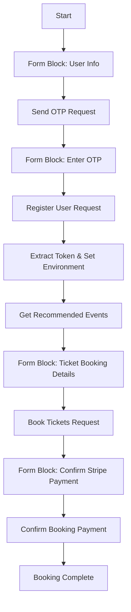
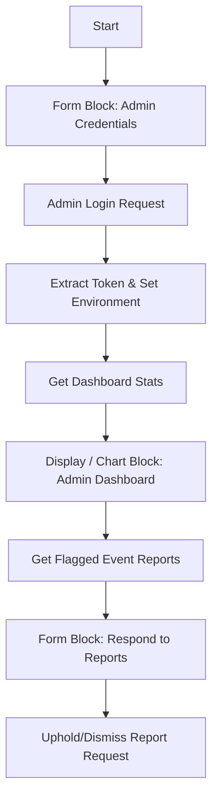
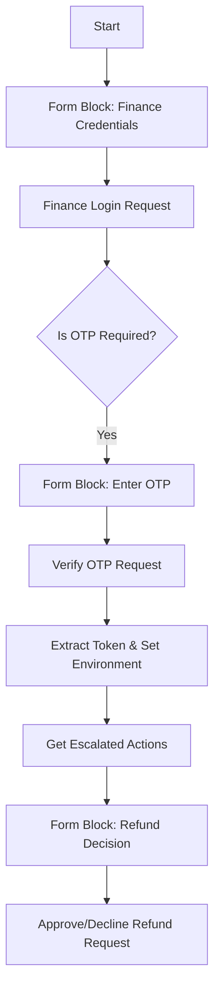

# Postman Flows Guide: Visual Workflow Automation

Postman Flows is a visual, node-based programming editor that allows you to chain API requests, handle conditional routing, capture manual user input mid-flow, and build dynamic dashboards.

This guide outlines how to build three distinct flows for our Event Management system:
1. **User (Attendee & Organizer) Flow**
2. **Admin Flow (with Dashboard Analytics)**
3. **Finance Flow (with Multi-Factor Authentication)**

---

## Prerequisites & Collection Mapping

Before building your flows, ensure you have:
1. Imported the **Event Management API Collection** (divided into folders: `User`, `Admin`, `Finance`).
2. Configured your **Postman Environment** (`Event Management - Local`) containing:
   * `baseUrl`: `http://localhost:5106`
   * `token`: (Automatically populated by the flows)

### Essential Postman Flow Blocks Used:
* **Start Block**: Initializes variables at the beginning of execution.
* **Form / Input Block**: **Crucial for pausing and waiting for manual input.** Prompts the user with a UI form to type values during execution.
* **Send Request Block**: Selects a request from your collection, sets headers/parameters, and triggers the endpoint.
* **Evaluate (FQL) Block**: Performs data transformations (e.g. extracting the JWT token from the JSON body).
* **If / Decision Block**: Branches execution based on conditions.
* **Display / Chart Block**: Renders outputs (like tables, JSON, or charts) for dashboards.

---

## 1. User (Attendee & Organizer) Flow

This flow handles registration (with dynamic OTP prompts), browsing, and ticket booking. It pauses to wait for user choices at critical stages.



### Step-by-Step Implementation:

#### **Step 1.1: Start & User Info Form (Manual Pause)**
1. Add a **Start** block.
2. Connect it to a **Form** block (rename it to `User Details Form`). 
3. Configure the Form block fields:
   * `name` (Short Text)
   * `email` (Short Text)
   * `mobileNumber` (Short Text)
   * `password` (Password)
4. Add another field: `purpose` (Default: `registration`).

#### **Step 1.2: Send OTP**
1. Connect the `User Details Form` to a **Send Request** block.
2. Select `User/Authentication/Send OTP`.
3. In the Request body mapping, connect:
   * `email` ➔ `{{User Details Form.email}}`
   * `purpose` ➔ `{{User Details Form.purpose}}`
4. Run the request. The backend will dispatch an OTP to the email.

#### **Step 1.3: Wait for OTP Input (Manual Pause)**
1. Connect the output of the Send OTP block to a new **Form** block (rename to `OTP Verification Form`).
2. Add a single field:
   * `otp` (Short Text)

#### **Step 1.4: Register User & Extract Token**
1. Connect the `OTP Verification Form` to a **Send Request** block.
2. Select `User/Authentication/Register`.
3. Map the fields using FQL or direct selectors:
   * `name` ➔ `{{User Details Form.name}}`
   * `email` ➔ `{{User Details Form.email}}`
   * `mobileNumber` ➔ `{{User Details Form.mobileNumber}}`
   * `password` ➔ `{{User Details Form.password}}`
   * `consentedTermsId` ➔ `10000` *(Active Terms ID seeded in database)*
   * `hasMarketingConsent` ➔ `true`
   * `otp` ➔ `{{OTP Verification Form.otp}}`
4. Connect the response of this block to an **Evaluate (FQL)** block:
   ```fql
   body.token
   ```
5. Connect the Evaluate block output to a **Set Variable** block, assigning the value to your environment variable `token`.

#### **Step 1.5: Retrieve Recommendations & Choose Tickets (Manual Pause)**
1. Connect the `Set Variable` block to a **Send Request** block selecting `User/Events/Get Recommended Events`.
2. Connect the response of this request to a **Display** block (to show the user available event listings) and a **Form** block (rename to `Ticket Booking Form`).
3. In `Ticket Booking Form`, add fields:
   * `eventId` (Number - gathered from recommendations)
   * `generalTickets` (Number)
   * `vipTickets` (Number)

#### **Step 1.6: Book Tickets & Confirm Payment**
1. Connect the `Ticket Booking Form` to a **Send Request** block selecting `User/Bookings/Book Tickets`.
2. Map the request payload:
   * `eventId` ➔ `{{Ticket Booking Form.eventId}}`
   * `tierQuantities` ➔
     ```json
     {
       "General Admission": {{Ticket Booking Form.generalTickets}},
       "VIP Access": {{Ticket Booking Form.vipTickets}}
     }
     ```
3. Connect the output to a new **Form** block (rename to `Payment Form`). Add field:
   * `stripeChargeId` (Short Text - copy mock Stripe charge ID)
4. Connect `Payment Form` to **Send Request** block selecting `User/Bookings/Confirm Booking Payment`.
   * Pass the `bookingId` in the URL from the previous booking response: `{{Book Tickets.body.booking_Id}}`.
   * Map the `stripeChargeId` in the request body.

#### **Step 1.7: Submit Support Query (Optional)**
1. Connect the `Set Variable` block (populated during login/registration) to a **Form** block (rename to `Support Ticket Form`).
2. Add fields:
   * `subject` (Short Text)
   * `message` (Short Text)
   * `requestType` (Short Text)
   * `relatedId` (Number - Optional, e.g. a specific Booking ID or Event ID)
3. Connect the `Support Ticket Form` to a **Send Request** block selecting `User/Support/Submit Support Ticket`.
4. Map the fields to the request JSON body:
   * `subject` ➔ `{{Support Ticket Form.subject}}`
   * `message` ➔ `{{Support Ticket Form.message}}`
   * `requestType` ➔ `{{Support Ticket Form.requestType}}`
   * `relatedId` ➔ `{{Support Ticket Form.relatedId}}`

---

## 2. Admin Flow (With Dashboard UI)

This flow logs the administrator in, retrieves dashboard statistics, and visualizes the platform data using charts. It then prompts for ticket allocations and report reviews.



### Step-by-Step Implementation:

#### **Step 2.1: Login Form (Manual Pause)**
1. Add a **Start** block.
2. Connect it to a **Form** block (rename to `Admin Login Form`).
3. Add fields:
   * `adminId` (Short Text, e.g., `ADM01`)
   * `password` (Password, e.g., `AdminPassword123!`)

#### **Step 2.2: Admin Authentication**
1. Connect `Admin Login Form` to a **Send Request** block.
2. Select `Admin/Authentication/Admin Login`.
3. Map the fields:
   * `adminId` ➔ `{{Admin Login Form.adminId}}`
   * `password` ➔ `{{Admin Login Form.password}}`
4. Connect the output of the Login block to an **Evaluate** block:
   ```fql
   body.token
   ```
5. Connect the Evaluate block to a **Set Variable** block to update the `token` variable.

#### **Step 2.3: Retrieve and Visualize Dashboard Metrics**
1. Connect the `Set Variable` block to a **Send Request** block selecting `Admin/Dashboard & Stats/Get Dashboard Stats`.
2. Connect the response body output to a **Display** block configured as a **Bar Chart** or **KPI Grid**:
   * Set metrics fields to display properties from the response DTO (e.g. `totalBookings`, `totalRevenue`, `flaggedEventsCount`).
   * *This forms the real-time visual dashboard indicating the system's current state.*

#### **Step 2.4: Review Event Reports & Moderate (Manual Pause)**
1. Connect the `Get Dashboard Stats` response to a **Send Request** block selecting `Admin/Event Reports/Get Flagged Event Reports`.
2. Pipe the list of flagged events into a **Display** table so the administrator can inspect them.
3. Connect the output to a **Form** block (rename to `Report Action Form`) with fields:
   * `reportId` (Number)
   * `action` (Dropdown/Short Text: Select `Uphold` or `Dismiss`)
   * `reason` (Short Text)
   * `organizerAction` (Short Text: `Restrict`, `Deactivate`, or `No Action`)
    * **If `action` is `Uphold`**: Send to `Admin/Event Reports/Uphold Report` mapping `reportId` in the route.
    * **If `action` is `Dismiss`**: Send to `Admin/Event Reports/Dismiss Report` mapping `reportId` in the route.

#### **Step 2.5: Review Support Tickets & Escalate (Optional)**
1. Connect the `Set Variable` block (after admin authentication) to a **Send Request** block selecting `Admin/Support & Escalation/Get All Support Tickets`.
2. Connect the response body array to a **Display** block configured as a Table so the admin can review the list of queries, including their associated `relatedId` fields.
3. Connect the output to a **Form** block (rename to `Support Ticket Action Form`) with fields:
   * `ticketId` (Number)
   * `action` (Dropdown/Short Text: Select `Respond` or `Escalate`)
   * `responseText` (Short Text - required if responding)
   * `actionType` (Short Text - e.g., `REF` for refund escalations)
   * `targetType` (Short Text - e.g., `ATD` for attendee target)
   * `targetId` (Number)
   * `referenceId` (Number - Event or Booking ID)
4. Route `Support Ticket Action Form` to an **If / Decision** block:
   * **If `action` is `Respond`**: Trigger `Admin/Support & Escalation/Respond to Support Ticket` mapping `ticketId` to the route path.
     * Map `response` ➔ `{{Support Ticket Action Form.responseText}}` in request body.
   * **If `action` is `Escalate`**: Trigger `Admin/Support & Escalation/Escalate Support Ticket to Finance` mapping `ticketId` to the route path.
     * Map `actionType`, `targetType`, `targetId`, and `referenceId` from the form fields to the request JSON body.

---

## 3. Finance Flow (With MFA OTP Verification)

This flow demonstrates handling multi-factor verification for the Finance role, reviewing escalated billing tasks, and issuing refunds.



### Step-by-Step Implementation:

#### **Step 3.1: Login Form (Manual Pause)**
1. Add a **Start** block.
2. Connect to a **Form** block (rename to `Finance Login Form`).
3. Add fields:
   * `adminId` (Short Text, e.g., `FIN01`)
   * `password` (Password, e.g., `FinancePassword123!`)

#### **Step 3.2: Finance Login OTP Check**
1. Connect `Finance Login Form` to a **Send Request** block selecting `Finance/Authentication/Finance Login`.
2. Connect the response to a **Decision / If** block.
3. Add the rule condition:
   ```fql
   body.otpRequired == true
   ```
4. **If True**: Route execution to a new **Form** block (rename to `Finance OTP Form`).
   * Add field: `otp` (Short Text)
5. Connect `Finance OTP Form` to a **Send Request** block selecting `Finance/Authentication/Verify Finance Login OTP`.
   * Map `adminId` and `otp` fields.
6. Connect the output of the Verification request to an **Evaluate** block to extract the token, then to a **Set Variable** block to update the `token`.

#### **Step 3.3: Fetch Escalated Actions & Process Refund (Manual Pause)**
1. Connect the `Set Variable` block to a **Send Request** block selecting `Finance/Dashboard & Approvals/Get Escalated Finance Actions`.
2. Feed the results list to a **Display** table.
3. Connect the output to a **Form** block (rename to `Refund Decision Form`) with fields:
   * `actionId` (Number)
   * `decision` (Short Text: Select `Approve` or `Decline`)
   * `refundType` (Short Text: `FUL`, `DYN`, `REM`, `NOR` for approvals)
   * `messageOrRemarks` (Short Text)
4. Route `Refund Decision Form` to a **Decision** block:
   * **If `decision` is `Approve`**: Trigger `Finance/Dashboard & Approvals/Approve Escalated Action` mapping `actionId` to the route path and request parameters.
   * **If `decision` is `Decline`**: Trigger `Finance/Dashboard & Approvals/Decline Escalated Action` mapping `actionId` to the route path and remarks parameter.

---

## Pro-Tips for Postman Flows Configuration
* **Interactive Run**: When executing a flow, Postman highlighting will trace the execution path. When it encounters a **Form** block, the flow will pause and display the input form in the sidebar. Once you submit the form, the flow continues immediately.
* **Troubleshooting Logs**: If a node fails, hover over it to view the exact payload or connection values passed through. Check the **Console** (bottom-left) to view active HTTP transactions.
