## Event Management & Ticketing Platform

The frontend will provide it as a single json, so handle the request accordingly.

The Qr code musthave under a directory named booking under attendeeid directory inside assets,

Like the same, the support ticket will also be saved inside a folder named support by the frontend.

the event description and image file must be saved inside a folder named events, by the frontend

All this folders comes inside the attendee id folder inside assets, in the Event.Business.

Now go ahead and modify the qr 

No need of any testing for it!

just migrate, update and build

### Requirements:
Objective:
Develop a complete enterprise-grade application using layered architecture with PostgreSQL, ASP.NET Core Web API, and Angular frontend.

Core Modules:
• Event Creation
• Ticket Booking
• Seat Allocation
• QR Entry

Key Features:
• Real-time availability
• Email queue

Suggested Architecture:
Angular Frontend → ASP.NET Core Web API → Service Layer → Repository Layer → PostgreSQL Database

Azure Integration:
• Azure Service Bus

Student Deliverables:
• Requirement Document
• ER Diagram
• API Documentation
• Angular Screens
• Authentication & Authorization
• CRUD APIs
• Search & Pagination
• Deployment Steps

Phase 2 Enhancements:
• Scalable deployment

### Database Schema:

#### 1. Identity & User Access
#### Users:
    User_Id: int => PK (Unique identifier for the user)
    Name: str => (Full name of the user)
    Email: str => (Unique email address)
    Mobile_Number: str => (Mobile contact number)
    Password_Hash: str => (Hashed password for login)
    Has_Marketing_Consent: bool => (True if user opted-in to regional recommendations)
    Consented_Terms_Id: str => FK (References TermsAndConditions table, appeds the ids 'G10001E10002)
    Password_Reset_Token: str? => (Cryptographically secure password reset token for account recovery, nullable)
    Status: str => (Account status: 'Active', 'Restricted', or 'Deactivated')

#### Admins:
    Admin_Id: str => PK (Company-assigned alphanumeric ID, e.g., 'ADM_1001')
    Name: str => (Full name of the administrator)
    Email: str => (Unique administrator email address)
    Password_Hash: str => (Hashed password for administrator verification)
    Password_Reset_Token: str? => (Cryptographically secure password reset token for admin password recovery, nullable)

#### 2. Regional Management & Staff
#### Management (Regions):
    Region_Id: str => PK (Will be allocated for every region where the event is occurring / Ex: 'CHE_1021')
    No_Of_Staffs: int => (This contains the support staffs available in that region)
    Region_Name: str

#### UserInterestedRegions:
    User_Id: int => PK, FK (References Users table)
    Region_Id: str => PK, FK (References Management table)

#### Staffs:
    Employee_ID: int => PK (ID of the Staff)
    Name: str => (Full name of the support staff member)
    Email: str => (Unique email address of the support staff member)
    Region_Id: str => FK (References Management table, says which region support staff is working)
    IsAllocated: bool => (Whether the staff is allocated to any event)

#### EventStaffAllocations:
    Event_Id: int => PK, FK (References Events table)
    Employee_ID: int => PK, FK (References Staffs table)

#### 3. Venue Configuration
#### Venues:
    Venue_Id: int => PK (Unique identifier for the physical venue)
    Region_Id: str => FK (References Management table)
    Name: str => (Name of the venue, e.g., 'City Auditorium')
    Address: str => (Physical address of the venue)
    Hourly_Price: decimal => (Hourly rental price charged to organizers)
    Is_Available: bool => (True if the venue is active and available for bookings)

#### VenueSeatCapacities:
    Venue_Id: int => PK, FK (References Venues table)
    Tier_Name: str => PK (The physical tier name: 'Elite', 'Gold', 'Silver')
    Total_Seats: int => (The total number of physical seats available in this tier for this venue)

#### 4. Events & Ticketing Setup
#### Events:
    Event_Id: int => PK (Unique identifier for the event)
    Organizer_Id: int => FK (References Users table)
    Venue_Id: int? => FK (References Venues table, NULL if pure virtual)
    Event_Type: str => (Type: 'Physical', 'Virtual', 'Hybrid')
    Title: str => (Title of the event)
    Description_Url: str => (Contains the URL Path of Detailed description of the event)
    Image_Url: str? => (URL path of the event banner image, nullable)
    Date_Time: timestamp => (Scheduled date and time of the event)
    Duration_Hours: decimal => (Duration of the event in hours, used to calculate venue rental cost)
    Status: str => (Status: 'Live', 'Cancelled', 'Completed', 'Failed')
    Requires_Staff: bool => (True if the organizer requested platform support staff)
    Virtual_Url: str? => (Streaming link for Virtual/Hybrid events, managed by organizer)
    Virtual_Password_Hash: str? => (Hashed meeting passcode for private streams)

#### EventTicketTiers:
    Event_Id: int => PK, FK (References Events table)
    Tier_Name: str => PK (The tier name: 'Elite', 'Gold', 'Silver')
    Price: decimal => (Event-specific price set by the organizer for this tier)
    Tickets_Sold: int => (Count of tickets sold for this tier in this event. Validated against VenueSeatCapacities.Total_Seats during booking)

#### 5. Bookings & Attendance
#### Bookings:
    Booking_Id: int => PK (Unique identifier for the booking)
    Attendee_Id: int => FK (References Users table)
    Event_Id: int => FK (References Events table)
    Booking_Status: str => (Status: 'Payment Pending', 'Confirmed', 'Cancelled', 'Refunded', 'Payment Failed')
    Qr_Code_Path: str? => (Local file path for the verified QR ticket, NULL until payment success)
    Qr_Secret_Hash: str? => (Cryptographically secure hash of the QR code plain-text token/key, validated on entry)
    CheckIn_Status: str => (Status: 'Pending', 'Checked-In')
    Created_At: timestamp => (Time when booking was initiated)
    Virtual_Url: str? => (The Jitsi meeting URL, populated for virtual or hybrid events)

#### BookingDetails:
    Booking_Id: int => PK, FK (References Bookings table)
    Tier_Name: str => PK (The tier name: 'Elite', 'Gold', 'Silver')
    Quantity: int => (The number of tickets purchased in this tier for this booking)

#### 6. Financials & Transaction Ledger
#### Transactions:
    Transaction_Id: int => PK (Unique identifier for the ledger transaction)
    Sender_Id: str => (Sender account details, e.g. 'Attendee_User_12' or 'Platform_Escrow')
    Receiver_Id: str => (Receiver account details, e.g. 'Platform_Escrow' or 'Organizer_User_8')
    Transaction_Type: str => (Type: 'BookingPayment', 'BookingRefund', 'OrganizerUpfrontPayment', 'OrganizerPayout')
    Related_Id: int => (ID linking to the source record based on type, e.g., Booking_Id, Event_Id, or Payout_Id)
    Amount: decimal => (Total value transacted)
    Currency: str => (Currency code, e.g. 'INR', 'USD')
    Payment_Method_Details: str? => (Type and details of payment source, e.g. 'Card: Visa ****4242')
    Status: str => (Status: 'Pending', 'Success', 'Failed', 'Refunded')
    Refunded_Amount: decimal => (Amount refunded so far, defaults to 0)
    Remarks: str? => (Error logs or transaction details, e.g. Stripe decline codes)
    Transaction_Reference: str? => (Stripe charge/transfer ID, e.g. 'ch_3MxsJf...')
    Created_At: timestamp => (Timestamp of the ledger entry)

#### BookingPayments:
    Booking_Payment_Id: int => PK (Unique identifier for the payment record)
    Booking_Id: int => FK (References Bookings table)
    Transaction_Id: int => FK (References Transactions table)
    Amount: decimal => (Total amount paid by the attendee)
    Platform_Fee_Cut: decimal => (The commission fee amount retained by the platform)
    Payment_Status: str => (Status: 'Success', 'Failed', 'Refunded')
    Created_At: timestamp => (Timestamp of the transaction)

#### OrganizerUpfrontPayments:
    Upfront_Payment_Id: int => PK (Unique identifier for the organizer's upfront payment)
    Event_Id: int => FK (References Events table)
    Transaction_Id: int => FK (References Transactions table)
    Amount: decimal => (Total amount paid by the organizer for platform activation, venue, or staff)
    Payment_Status: str => (Status: 'Success', 'Failed', 'Refunded')
    Created_At: timestamp => (Timestamp of the transaction)

#### OrganizerPayouts:
    Payout_Id: int => PK (Unique identifier for the payout)
    Event_Id: int => FK (References Events table)
    Transaction_Id: int? => FK (References Transactions table, NULL until payout is processed/attempted)
    Total_Ticket_Sales: decimal => (Sum of all attendee payments for this event)
    Platform_Commission: decimal => (Total platform fees deducted from sales)
    Payout_Amount: decimal => (Net amount sent to the organizer: Total Sales - Commission)
    Payout_Status: str => (Status: 'Success', 'Failed', 'Refunded')
    Processed_At: timestamp => (Timestamp of when the payout was processed)

#### 7. Customer Support & Auditing
#### SupportTickets:
    Ticket_Id: int => PK (Unique identifier for the support ticket)
    User_Id: int => FK (References Users table, the person who raised the ticket)
    ConcernUrl: str => (URL/path to local or blob file storing the Subject, Message, and Response details)
    RequestType: str => (Category abbreviation: 'REF' - Refund/Cancellation, 'EVT' - Event/Technical, 'ACC' - Account/Auth, 'FIN' - Financial/Payout, 'GEN' - General Query)
    Status: str => (Status of the ticket: 'Open', 'Resolved')
    EsclationStatus: str? => (Escalation availability status: 'Available' or 'Escalated')

#### AdminActions:
    ActionId: int => PK (Unique identifier for the admin action log)
    AdminId: str => FK (References Admins table, the administrator who performed the action)
    ActionType: str => (Category abbreviation of the request: REF, EVT, ACC, FIN, GEN)
    TargetType: str => (Target entity type: ATD for attendee, ORG for organizer, EVT for event)
    TargetId: int => (Attendee/Organizer/Event ID)
    TicketId: int? => FK (References SupportTickets table, nullable)
    ActionStatus: str => ("Pending", "Declined", "Processing", "Processed")
    Remarks: str? => (Additional log remarks/error details)
    CreatedAt: timestamp => (Timestamp of the action log entry)

#### EventReports:
    Report_Id: int => PK (Unique identifier for the flag report)
    Event_Id: int => FK (References Events table)
    Reporter_Id: int => FK (References Users table)
    Reason: str => (Reason for reporting, e.g., spam, scam, policy violation)
    ResponseAction: str? => (Moderation response action: 'Dismissed' or 'Upholds', nullable)
    Created_At: timestamp => (Time when the report was submitted)

#### 8. Governance & Platform Settings
#### PlatformSettings:
    Settings_Id: int => PK (Always 1, enforcing a single global configuration row)
    Staff_Flat_Rate: decimal => (Flat fee charged to organizers per allocated staff employee)
    Virtual_Event_Activation_Fee: decimal => (Platform publishing/licensing fee for virtual events)
    Physical_Event_Activation_Fee: decimal => (Platform base activation fee for physical/hybrid events)
    Ticket_Commission_Percentage: decimal => (Percentage fee cut taken from ticket sales, e.g., 5.0)
    Ticket_Fixed_Fee: decimal => (Flat fee cut taken from ticket sales, e.g., 0.99)
    Max_Tickets_Per_Booking: int => (Max tickets allowed per individual booking transaction, default: 10)
    Updated_At: timestamp => (Timestamp of when configurations were last modified)
    Updated_By_Admin_Id: str => FK (References Admins table, tracks which admin changed the settings)

#### TermsAndConditions:
    Terms_Id: int => PK (Unique identifier for terms version)
    Version: str => (Version identifier, e.g., 'v1.0')
    File_Path: str => (Local file path storing the terms and conditions document, e.g., '/docs/policies/terms_v1.0.md')
    Type: str => (Type of policy, e.g., 'General', 'EventCreation', 'Cancellation')
    Is_Active: bool => (True if this is the current active version that users must consent to)
    Created_At: timestamp => (Timestamp when this version was published)

#### Notifications:
    Notification_Id: int => PK (Unique identifier for the notification)
    Recipient_Email: str => (Destination email address)
    Subject: str => (Email subject line)
    Body: str => (HTML or plain text email body)
    Status: str => (Status: 'Pending', 'Sent', 'Failed')
    Retry_Count: int => (Number of times delivery has been retried)
    Created_At: timestamp => (Time when the notification was queued)
    Sent_At: timestamp? => (Time when the email was successfully sent, NULL if not sent yet)
    ErrorMessage: str? => (Error message in case of failure)

#### EventFeedback:
    Feedback_Id: int => PK (Unique identifier for feedback)
    Event_Id: int => FK (References Events table)
    Attendee_Id: int => FK (References Users table)
    Rating: int => (Rating value, e.g., 1 to 5)
    Review: str => (Written review comments)

----------------------------------------------------

### Future Updates & Optimization:

1. Distributed OTP Caching (Redis Cache) ✅:
=> Instead of storing OTP codes in-memory which resets on server restarts and fails under load-balanced/multi-server setups, implement Redis Cache (via .NET IDistributedCache).
- Stores the email address as the key and the OTP verification record as the value.
- Configures an automatic Time-To-Live (TTL) of 10 minutes to auto-delete expired OTPs.
- Resolves multi-instance synchronization issues for horizontal scaling.

2. Automatic Terms & Conditions Re-consent:
=> When a new active version of terms and conditions is published, existing users will automatically receive a notice/modal on their dashboard upon login to accept the latest terms.
- Restricts key dashboard actions until the user consents to the new version.
- Enqueues an automated email notification to all registered users detailing the policy updates.

3. Link-Based Password Recovery:
=> Transition from the current 6-digit OTP email verification model to a secure, email-based password reset link flow.
- Generates a cryptographically secure, single-use token (saved to `Password_Reset_Token` with an expiration timestamp).
- Emails the user a unique link containing the token to safely authorize a password change.

4. Notification as a separate microservice:
- Make email service as a separate webapi constantly looking for the notification table.

5. Secure Virtual Meeting Moderation (Jitsi JWT):
=> Integrate JSON Web Tokens (JWT) for Jitsi virtual meetings to explicitly assign moderator rights via the meeting URL.
- Automatically generates a JWT on the server with user details and a `"moderator": true` flag for the event organizer.
- Appends the JWT to the meeting link (e.g., `?jwt=TOKEN`) to prevent unauthorized users from gaining moderator privileges just by joining first.
- The business layer services will update the notification table with the record status as pending.
- As soon as the record added, the email service will process it and change its status.

6. Geospatial Coordinates & Radius Filtering (Nearby Events):
=> Integrate geospatial coordinates (Latitude & Longitude) for venues to support continuous distance filtering.
- Update the Venues model to store coordinates.
- Implement distance calculation (e.g., Haversine formula or PostgreSQL PostGIS functions) in the backend repository layer to keep calculation server-side.
- Expose a client API that accepts user lat/long and a search radius, returning sorted, nearby events.

7. Relational Database/Blob Storage for Ticket Concerns:
=> Transition support ticket message details from flat file system JSON storage (via local `ConcernUrl` files) to structured database tables or scalable Cloud Object Storage (e.g., AWS S3 or Azure Blob Storage).
- Avoids concurrency locking exceptions during simultaneous file read/write operations.
- Enhances text searchability, sorting, and indexing of user concerns and replies directly through SQL.

9. Ticket Tier Validation & Free Events Handling:
=> Rectify event creation validation to enforce that any physical, virtual, or hybrid event must define at least one ticket tier (ensuring `ticketTiers` is not empty).
- Implement validation checks preventing the creation of events without defined entry options.
- Establish clean processing workflows for free events (ticket tier price is set to ₹0.00), automatically bypassing Stripe checkout and payment confirmations for zero-amount transactions to avoid Stripe's minimum transaction limits.

8. CDN Static Policy Hosting and In-Memory Caching:
=> Transition policy document hosting and retrieval from server-side file system reads to public Content Delivery Network (CDN) static files combined with memory caching.
- Store static markdown documents on a CDN (e.g., Cloudflare, CloudFront) to cache them globally at the network edge.
- Implement in-memory caching (e.g., IMemoryCache) in the Policy Service to cache content on the server after the first disk read, resolving CPU/disk I/O bottlenecks.

9. Custom Ticket Tier Capacities:
=> Currently, when an organizer creates a physical or hybrid event, the total seating capacity for each ticket tier is strictly locked to the hardcoded `Total_Seats` defined by the `VenueSeatCapacity` of the chosen venue. The frontend does not have the ability to override this value, and the backend `EventTicketTier` entity lacks a `Capacity` column, meaning organizers cannot intentionally limit ticket sales to a number lower than the venue's maximum capacity (e.g., selling only 450 tickets for a 500-seat venue). To resolve this in the future, we need to run a database migration to add a `Capacity` (or `Max_Capacity`) column to the `EventTicketTier` table. Following this, the backend DTOs (`CreateTicketTierRequest`) and the `CreateEventRequest` mapping must be updated to accept and persist this custom capacity during event creation. Additionally, the booking validation logic within `BookingService` needs to be updated to check `eventTier.Tickets_Sold + quantity <= eventTier.Capacity` instead of strictly relying on the venue's predefined capacity. Finally, the frontend must be updated to remove the `readonly` attribute from the tier capacity inputs, restore the capacity validation warnings (exceeded/underutilized) in the UI, and correctly pass the custom capacity values in the API payload during checkout.

### Services:

------ Authentication & Setup ------

1. SendEmailOTP:
=> Generates and sends a temporary one-time passcode (OTP) to the user's email address for verification during registration or password recovery.

2. RegisterUser:
=> Validates the email OTP, verifies terms consent in the service layer, registers a new account (stores name, email, mobile number, password hash, and the accepted terms version ID), and returns an authentication token.

3. SelectInterestedRegion:
=> Collects and saves the interested region of a user during onboarding/initial setup to personalize event discovery and notification delivery.

4. LoginUser:
=> Authenticates credentials (email and password) and returns a unified JWT token that authorizes the user as both an organizer and attendee.

5. LoginAdmin:
=> Authenticates administrative credentials using the company-assigned Admin_Id and password, returning an administrator-scoped JWT token.

6. UpdateUserProfile:
=> Allows users to update their personal details (name, contact number).

6b. GetMyEvents:
=> Retrieves a list overview of events created by the authenticated organizer. Excludes sensitive virtual event details.

6c. ViewMyEvent:
=> Retrieves all details of a specific event created by the organizer, including virtual meeting links and password hashes.

7. ResetPassword:
=> Verifies the email OTP for password recovery and updates the user's password in the database.

------ Event Creation & Management (Organizer) ---------

8. CreateEvent:
=> Allows an organizer to create a new event (either Virtual or Physical). The organizer must explicitly accept the displayed policy agreement (setting `HasAcceptedPolicy` to true) before creation can proceed. The event must be scheduled at least 24 hours in the future to allow for venue and support staff allocation. The event requires completing an upfront fee payment before publishing. Once paid, the event status becomes 'Live' and triggers a regional broadcast.

9. CalculateAndCheckStaffAvailability:
=> Calculates the support staff count required based on venue capacity, and checks if sufficient unallocated staff exist in the region for the event's date/time. Returns status to the client, allowing the frontend to immediately grey out the staff support option if unavailable.

10. CheckVenueAvailability:
=> Queries existing active events to check if a specific venue is free (not occupied or booked) during the requested date and time slot, preventing scheduling conflicts.

11. UpdateEventDetails:
=> Allows the organizer to modify event metadata or adjust ticket options before sales start.

12. CancelEvent:
=> Cancels a scheduled event, marks it as cancelled in the system, and triggers the refund workflow. If cancelled > 48 hours prior to event start, the organizer receives a 90% refund of their upfront fee; if cancelled between 24 and 48 hours prior to event start, the organizer receives a 50% refund; if cancelled < 24 hours prior, no refund of upfront fees is issued. This method publishes a cancellation email notification to all booked attendees.

13. ViewOrganizerDashboard:
=> Returns summary metrics (tickets sold, revenue, check-in percentages) for all events created by the logged-in user.

14. GetEventAttendeesList:
=> Retrieves the roster of registered attendees (names, ticket tiers, and check-in statuses) for a specific event hosted by the organizer (emails are omitted to enforce attendee privacy).

------ Event Search & Ticket Booking (Attendee) ---------

15. FilterEventsByRegion:
=> Filters upcoming events based on a specific Region_Id or RegionName, allowing users to find events local to their selected area.

16. Search&BrowseEvents:  
=> Uses a powerful algorithm.
=> Performs a text search and filters events by category and date range, returning paginated results. The business/service layer calculates the cutoff timestamp (30 minutes in the future) and passes it to the repository to ensure upcoming events are queryable until this cutoff.

17. GetEventDetails:
=> Retrieves complete event metadata, including host details, scheduling, seat layouts, ticket categories, and real-time ticket counts.

18. BookTickets:
=> Processes a purchase/reservation for a specified quantity of tickets within selected tiers. Executes thread-safe validation to ensure that the request does not exceed remaining capacity, saves the booking as 'Payment Pending' (locking the capacity), and starts a 5-minute checkout timer. If payment is verified within 5 minutes, status is changed to 'Confirmed'; otherwise, it is rolled back to 'Payment Failed' and capacity is released.

19. GetMyBookings:
=> Lists all upcoming and past event registrations purchased by the logged-in user.

20. CancelBooking:
=> Cancels a ticket reservation, restoring the booking capacity. If cancelled > 48 hours prior to event start, a 90% refund is processed via Stripe; if cancelled between 12 and 48 hours prior to event start, a 50% refund is processed; if cancelled < 12 hours prior, no refund is processed. Attendees receive 100% full refunds only if the event is cancelled by the organizer or overridden by an administrator.

21. ReportEvent:
=> Allows a user to flag/report an event for policy violations (e.g. scams, spam, inappropriate content), triggering an admin review.

22. SubmitSupportTicket:
=> Allows users (attendees or organizers) to submit support tickets or inquiries regarding bookings, payments, or event details.

23. SubmitEventFeedback:
=> Allows attendees to rate and submit reviews for events they have completed attending.

------ System & Automated Services ---------

24. BroadcastNewEventNotification:
=> Automatically triggered upon event publication to search for all users who selected the event's region as an interested region and enqueue broadcast notification emails via the email queue.

25. ReleaseExpiredBookings:
=> Automatically checks for 'Payment Pending' bookings exceeding the 5-minute checkout window, updates their status to 'Payment Failed', and releases locked ticket capacities back to the event pool.

------ Email Notification Services ---------

26. EnqueueEmailNotification:
=> Creates and inserts a notification record into the Notifications table with a status of 'Pending' (e.g. for registration welcome or booking confirmation).

27. SendEmailAsync:
=> Directly invokes the free Email service layer client (using MailKit/MimeKit SMTP relay) to send an email immediately.

28. ProcessNotificationQueueJob:
=> An automated background worker that polls the Notifications table for 'Pending' emails, sends them, and updates their status to 'Sent' or 'Failed' (with retry increments).

------ Payments ---------

29. ProcessPayment:
=> A unified payment service that processes transactions (such as ticket purchases for attendees or upfront activation/venue/staff fees for organizers), updates booking/event statuses to 'Confirmed' or 'Live', and generates receipts.

30. ProcessRefund:
=> A unified refund service that handles ticket booking refunds and organizer upfront fee refunds based on cancellation policy time-windows. Supports admin overrides for executing 100% full refunds or issuing remaining balances in the event of reported venue conflicts.

------ QR Entry & Ticket Verification ---------

31. GenerateDigitalTicket:
=> Generates a unique secure QR code encoding the booking reference signature for offline verification.

32. Verify&CheckInTicket:
=> Accessed via a secure, separate event-specific scanner URL provided in the event management console (which automatically expires and is invalidated once the event is marked 'Completed'). Used by organizers or staff at the venue entrance to scan, decrypt, and validate attendee QR tickets, updating their status to checked-in to prevent double-entry.
   * [Future Update]: Exactly 12 hours before the scheduled event start, a background job automatically emails this secure scanner link to the assigned support staff member's email address if a staff allocation exists.

------ Admin & Support Management ---------

33. GetGlobalDashboardStats:
=> Returns global platform stats including total users, total active events, total revenue, and staff allocation percentages.

34. ModerateEvents:
=> Allows an admin to review reported events, suspend policy-violating listings, and override refund constraints to facilitate full cancellations/refunds or pay remaining balances for events affected by venue conflicts.

35. ManageRegionsAndVenues:
=> Allows admins to define, add, update, or remove regions, and configure physical venues within those regions—including setting up the total seat capacity per tier (e.g., Elite, Gold, Silver).

35b. GetRegionsPublic:
=> Exposes a public GET /api/regions endpoint to list all available regions, allowing the frontend to dynamically fetch location details and map them to a region ID.

36. ManageSupportStaffs:
=> Performs CRUD operations on support staff records, registering employee profiles and their working regions.

37. AllocateStaffToEvent:
=> Assigns available support staff to a specific event within their working region, triggered only after payment is verified for events requesting platform staff.

38. ConfigurePlatformSettings:
=> Allows admins to configure transaction fees, commissions, and standard support staff booking rates.

39. ProcessOrganizerPayout:
=> Triggered by the administrator after an event concludes. Requires inputting secure admin credentials to re-authenticate, aggregates total ticket sales, subtracts platform commission, triggers the payment gateway payout, and inserts a payout record.

40. ResolveUserQuery:
=> Allows admins/support staff to reply to and resolve support queries or tickets raised by users by editing the concern JSON file, changing status to Resolved, and emailing the response.

40.1. GetSupportTickets:
=> Allows admins to view all support tickets in the platform.

40.2. EscalateSupportTicket:
=> Allows admins to escalate support tickets, adding a pending action record under AdminActions and updating the ticket's escalation status to 'Escalated'.

------ Virtual Meeting Integration (Jitsi Meet) ---------

41. GenerateVirtualMeetingRoom:
=> Triggered programmatically for Virtual or Hybrid events. Generates a unique room URL (using Jitsi Meet) and a secure access passcode, saving the passcode hash. When the event is marked as 'Completed', the meeting link is expired, cleared from the database, and greyed out in the organizer's dashboard.

42. JoinVirtualMeeting:
=> Validates that the logged-in user is either the event organizer or has a 'Confirmed' ticket booking for the event. If authorized, returns the Jitsi room details and injects the passcode via the Jitsi IFrame SDK automatically to grant seamless video entry while blocking unauthorized direct access.

### Repositories:

------ Generic Repository ------

GenericRepository<T>:
=> Defines standard CRUD operations applicable to all database entities, reducing code duplication.
- GetByIdAsync(id: TId): Task<T>
- GetAllAsync(): Task<IEnumerable<T>>
- AddAsync(entity: T): Task
- UpdateAsync(entity: T): Task
- DeleteAsync(entity: T): Task

------ Custom Repositories ------

UserRepository:
=> Inherits GenericRepository<User> and defines custom queries for user records.
- GetByEmailAsync(email: str): Task<User>

AdminRepository:
=> Inherits GenericRepository<Admin> and defines admin authentication.
- GetByAdminIdAsync(adminId: str): Task<Admin>

EventRepository:
=> Inherits GenericRepository<Event> and defines custom paginated event searches.
- SearchEventsAsync(keyword: str, category: str, minDateTime: timestamp, regionId: str, page: int, size: int): Task<PagedResult<Event>>
- GetEventDetailsAsync(eventId: int): Task<Event>

VenueRepository:
=> Inherits GenericRepository<Venue> and defines venue occupancy checks.
- IsVenueOccupiedAsync(venueId: int, dateTime: timestamp): Task<bool>

StaffRepository:
=> Inherits GenericRepository<Staff> and handles support staff availability and allocation.
- GetAvailableStaffCountAsync(regionId: str, dateTime: timestamp): Task<int>
- GetAvailableStaffsAsync(regionId: str, dateTime: timestamp): Task<IEnumerable<Staff>>

BookingRepository:
=> Inherits GenericRepository<Booking> and handles reservations.
- GetBookingsByUserIdAsync(userId: int): Task<IEnumerable<Booking>>
- GetBookingDetailsAsync(bookingId: int): Task<Booking>

SupportTicketRepository:
=> Inherits GenericRepository<SupportTicket> and handles customer tickets.
- GetTicketsByUserIdAsync(userId: int): Task<IEnumerable<SupportTicket>>
- GetPendingTicketsAsync(): Task<IEnumerable<SupportTicket>>

BookingPaymentRepository:
=> Inherits GenericRepository<BookingPayment> and retrieves transaction details.
- GetPaymentsByBookingIdAsync(bookingId: int): Task<IEnumerable<BookingPayment>>

OrganizerUpfrontPaymentRepository:
=> Inherits GenericRepository<OrganizerUpfrontPayment> and retrieves organizer upfront payments.
- GetUpfrontPaymentsByEventIdAsync(eventId: int): Task<IEnumerable<OrganizerUpfrontPayment>>

OrganizerPayoutRepository:
=> Inherits GenericRepository<OrganizerPayout> and manages payouts.
- GetPayoutByEventIdAsync(eventId: int): Task<OrganizerPayout>
- GetPendingPayoutsAsync(): Task<IEnumerable<OrganizerPayout>>

TransactionRepository:
=> Inherits GenericRepository<Transaction> and manages the audit ledger.
- GetTransactionsByUserIdAsync(userId: int): Task<IEnumerable<Transaction>>
- GetTransactionByReferenceAsync(reference: str): Task<Transaction>

PlatformSettingsRepository:
=> Inherits GenericRepository<PlatformSettings> and manages global platform configurations.
- GetSettingsAsync(): Task<PlatformSettings>

TermsAndConditionsRepository:
=> Inherits GenericRepository<TermsAndConditions> and manages policy versions.
- GetActiveTermsAsync(): Task<TermsAndConditions>
- GetTermsByVersionAsync(version: str): Task<TermsAndConditions>
- GetActiveTermsByTypeAsync(type: str): Task<TermsAndConditions>

NotificationRepository:
=> Inherits GenericRepository<Notification> and manages email queuing and retries.
- GetPendingNotificationsAsync(batchSize: int): Task<IEnumerable<Notification>>
- GetFailedNotificationsForRetryAsync(maxRetries: int, batchSize: int): Task<IEnumerable<Notification>>

AdminActionRepository:
=> Inherits GenericRepository<AdminAction> and manages administrative action logs.

### Architectural Configurations

1. RateLimiting:
=> Restricts the number of API requests from a single IP to prevent abuse, DoS attacks, and brute-force attempts.
- Global limit of 100 requests per minute per IP address.
- Strict limit of 10 requests per minute per IP on authentication and booking endpoints.
- Returns a 429 Too Many Requests status code with a standard JSON retry payload and Retry-After header.

2. API Idempotency:
=> Prevents duplicate execution of mutating operations due to client double-clicks, timeouts, or retries.
- Requires clients to send a unique X-Idempotency-Key (UUID/GUID) in request headers.
- Stores key and response in a distributed cache with a 24-hour TTL.
- Returns cached response on key re-submission, bypassing database/repo operations.
- Intercepts in-flight duplicate requests with a 409 Conflict status.

## Mermaid Design Code:

```mermaid
graph LR
    %% 1. Authentication & Onboarding
    UserRole[User Role] --> Register[Register and Set Region]
    Register --> DB_UserAdd[DB: Users.Add, UserInterestedRegions.Add, and Notifications.Add Welcome Email]
    DB_UserAdd --> UserRegions[Set Interested Region]
    
    UserRole --> Login[Login User]
    Login --> UserToken[Generate Unified JWT Token]
    UserToken --> UserRegions
    
    UserRegions --> UserDashboard[User Dashboard]
    
    AdminLogin[Admin Login] --> DB_AdminLog[DB: Admins.GetByAdminIdAsync]
    DB_AdminLog --> AdminDash[Admin Dashboard]

    %% 2. Attendee Booking Flow
    UserDashboard --> Browse[Browse Events Starts After 30m]
    Browse --> DB_Browse[DB: Events.SearchEventsAsync]
    DB_Browse --> Book[Book Tickets Select Tiers and Quantities]
    Book --> DB_LockCap[DB: Lock Seating Capacity and Check Seats]
    DB_LockCap --> Pending[Create Booking Pending and Log Transaction Pending]
    Pending --> DB_SaveBook[DB: Bookings.Add and Transactions.Add]
    DB_SaveBook --> GatewayCheckout{Stripe Checkout Session}
    
    GatewayCheckout -->|Payment Success| PaySuccess[Create BookingPayments and BookingDetails and Confirm Booking]
    PaySuccess --> DB_PaySuccess[DB: BookingPayments, Bookings Update, and Notifications.Add Confirmation Email]
    DB_PaySuccess --> QR[Display Digital QR Ticket to Attendee]

    GatewayCheckout -->|Failure / Session Timeout| PayFailed[Release Locked Seating Capacity and Update Booking Payment Failed]
    PayFailed --> DB_PayFailed[DB: Bookings.Update and Transactions.Update]

    %% 3. Organizer Event Creation & Management
    UserDashboard --> Create[Create Event Form Virtual Physical Hybrid]
    Create --> EvType{Event Type}
    
    EvType -->|Physical / Hybrid| PhysicalSetup[Check Venue and Staff Availability]
    PhysicalSetup --> DB_PhysCheck[DB: Venue and Staff Check]
    DB_PhysCheck --> CalcUpfront[Calculate Upfront Fee]
    
    EvType -->|Virtual| CalcVirtual[Calculate Upfront Fee Flat Platform Activation]
    
    CalcUpfront --> PayUpfront[ProcessPayment Organizer Upfront Fee]
    CalcVirtual --> PayUpfront
    PayUpfront --> UpfrontGateway{Stripe Checkout}
    
    UpfrontGateway -->|Payment Success| UpfrontSuccess[Save Event Live and Upfront Payment Success]
    UpfrontSuccess --> DB_SaveEvent[DB: Events and OrganizerUpfrontPayments Add]
    DB_SaveEvent --> JitsiSetup[Jitsi Meet Setup Save URL and Hashed Passcode]
    JitsiSetup --> LiveEvent[Event Live Trigger Regional Broadcast]

    UpfrontGateway -->|Payment Failure| UpfrontFailed[Update Transaction Failed]
    UpfrontFailed --> DB_SaveFailedTxn[DB: Transactions.Update Failed]
    
    UserDashboard --> ViewHosted[View Hosted Events Copy Jitsi URL and Password]
    ViewHosted --> DB_Hosted[DB: Events.GetEventDetailsAsync]

    %% 4. Admin Operations & Payouts
    AdminDash --> ConfigSettings[Configure Platform Settings]
    ConfigSettings --> DB_Settings[DB: PlatformSettings.UpdateSettingsAsync]
    
    AdminDash --> ManageVenues[Manage Venues Configure Seat Tiers and Hourly Prices]
    ManageVenues --> DB_Venues[DB: Venues.Add and VenueSeatCapacities.Add]
    
    AdminDash --> ViewPayouts[View Completed Events and Financials]
    
    %% Lifecycle from LiveEvent to Completion & Payout
    LiveEvent --> EventPasses{Event Date Passes}
    EventPasses -->|Yes| EventComplete[Mark Event Completed and Invalidate Jitsi Link]
    EventComplete --> DB_Complete[DB: Events.Update Status Completed]
    DB_Complete --> ViewPayouts
    
    ViewPayouts --> DB_QueryPayout[DB: OrganizerPayouts GetPendingPayouts]
    DB_QueryPayout --> ClickPayout[Click Payout Prompts Admin Credentials]
    ClickPayout --> AuthAdmin{Authenticate Admin Credentials}
    
    AuthAdmin -->|Success| GatePayout[Trigger Stripe Connect Payout to Host]
    GatePayout --> PayoutResult{Payout Successful}
    
    PayoutResult -->|Yes| PayoutSuccess[Create OrganizerPayouts Processed and Log Transaction Success]
    PayoutSuccess --> DB_RecordPayout[DB: OrganizerPayouts and Transactions Add]
    
    PayoutResult -->|No| PayoutFailed[Create OrganizerPayouts Failed and Log Transaction Failed]
    PayoutFailed --> DB_RecordPayoutFailed[DB: OrganizerPayouts and Transactions Add]

    %% 5. Cancellation & Refund Flow
    UserDashboard --> CancelBooking[Cancel Booking Attendee]
    CancelBooking --> CheckPolicy{Check Cancellation Timeline}
    CheckPolicy --> ProcessRefund[Process Stripe Refund Ticket Fee minus Platform Cut]
    ProcessRefund --> RefundSuccess[Cancel Booking and Log Transaction Refund Success]
    RefundSuccess --> DB_CancelBook[DB: Bookings and Transactions Update]
    
    ViewHosted --> CancelEvent[Cancel Event Organizer]
    CancelEvent --> DB_CancelEvt[DB: Events Update Status Cancelled]
    DB_CancelEvt --> RefundAll[Stripe Refund All Booked Attendees]
    RefundAll --> DB_RefundAllDetails[DB: Bookings and Staff Allocations Revert]

    %% 6. Background Email Processing
    MailWorker[Background Mail Worker] --> DB_GetPending[DB: Notifications.GetPendingNotificationsAsync]
    DB_GetPending --> SMTPRelay[Send Mail via MailKit/Brevo]
    SMTPRelay --> DB_UpdateMail[DB: Notifications.Update Status and Sent_At]
```

